# Аутлайн статьи: "Передача капитала детям. Мифы и реальность"

## Дерево Текущей Реальности (Логика Голдратта)

```mermaid
graph TD
    %% КОРНЕВЫЕ ПРИЧИНЫ (Отправные точки)
    RootAction[Действие: Передача большого капитала детям]
    RootBio[Факт: Биология требует дофамина от преодоления]
    RootWorld[Факт: Мир меняется быстрее поколений]
    RootTalent[Факт: Управление капиталом - это специфический талант]
    RootLove[Факт: Родители хотят безопасности и контроля]
    RootSociety[Факт: Общество ценит self-made успех]

    %% ВЕТВЬ МОТИВАЦИИ
    RootAction & RootBio --> EasyAccess[Легкий доступ к благам<br/>Метафора: Серебряная ложка]
    EasyAccess --> NoDragon[Нет своего Дракона / Вызова]
    NoDragon --> DopamineBreak[Слом дофаминовой системы]
    DopamineBreak --> MotivationLoss[Потеря внутренней мотивации<br/>Метафора: Тепличное растение]

    %% ВЕТВЬ КОМПЕТЕНЦИЙ (Потеря капитала)
    RootAction & RootWorld --> OutdatedExp[Опыт родителей устаревает<br/>СССР vs AI]
    OutdatedExp --> WrongDecisions[Ошибки управления]
    RootAction --> DeadHand[Передача после смерти<br/>Метафора: Холодные руки]
    DeadHand --> NoContext[Деньги без инструкции]
    WrongDecisions & NoContext --> CapitalLoss[Потеря капитала<br/>70% ко 2 поколению]

    %% ВЕТВЬ СВОБОДЫ (Золотая клетка)
    RootAction & RootTalent --> DutyToManage[Обязанность управлять активом]
    DutyToManage --> TalentMismatch[Несовпадение талантов ребенка и задач бизнеса]
    TalentMismatch --> GoldenCage[Несвобода / Нелюбимое дело<br/>Метафора: Золотые наручники]
    GoldenCage --> Unhappiness[Несчастье / Неэффективность]

    %% ВЕТВЬ СЕПАРАЦИИ
    RootAction & RootLove --> FinancialDependence[Финансовая зависимость]
    FinancialDependence --> SeparationBlock[Блокировка взросления<br/>Метафора: Тень предков]

    %% ВЕТВЬ ЛИЧНОСТИ И ОБЩЕСТВА (Психология наследника)
    RootAction & RootLove --> WealthIdentity[Богатство как часть личности]
    WealthIdentity --> ImposterSyndrome[Синдром самозванца<br/>Метафора: Чужой костюм]
    WealthIdentity --> Affluenza[Аффлюэнца / Болезнь богатства<br/>Метафора: Токсичная сытость]

    %% Отношение общества
    RootAction & RootSociety --> SocialStigma[Отношение общества<br/>Метафора: Рожденный на 3-й базе]
    SocialStigma --> Isolation[Социальная изоляция / Вакуум<br/>Метафора: Стеклянная стена]
    Isolation & ImposterSyndrome --> IdentityCrisis[Кризис идентичности<br/>Кто я без денег папы?]

    %% НЕГАТИВНЫЕ ЯВЛЕНИЯ (Итог)
    MotivationLoss & CapitalLoss & Unhappiness & SeparationBlock & IdentityCrisis --> UDE_Fail[Крах династии / Личная трагедия]

    %% АЛЬТЕРНАТИВНЫЕ ВМЕШАТЕЛЬСТВА (Инъекции)
    subgraph Injections [Инъекции / Решения]
        style Injections fill:#e1f5fe,stroke:#01579b,stroke-width:2px
        Inj_Opportunity[Фонд возможностей<br/>деньги под проект]
        Inj_Education[Инвестиции в образование<br/>Удочка вместо рыбы]
        Inj_DieZero[Die With Zero<br/>Тратить при жизни]
        Inj_SkipGen[Через поколение<br/>Внукам]
    end

    %% Влияние решений
    Inj_Opportunity -.->|Чинит| NoDragon
    Inj_Education -.->|Чинит| OutdatedExp
    Inj_DieZero -.->|Устраняет| DeadHand
    Inj_DieZero -.->|Снимает| GoldenCage
    Inj_Education -.->|Снимает| ImposterSyndrome
```

## Список метафор для статьи

### Метафоры несвободы и вреда
- **"Право на своего Дракона"** — необходимость для ребенка самому преодолеть трудности, чтобы стать героем своей жизни. Отнимая дракона, мы отнимаем победу.
- **"Золотые наручники"** — богатство как обязательство, которое привязывает к нелюбимому делу.
- **"Рабство у капитала"** / **"Слуга лампы"** — ситуация, когда наследник вынужден обслуживать капитал, вместо того чтобы жить свою жизнь.
- **"Тень предков"** — невозможность выйти из-под влияния авторитета родителей, постоянное сравнение не в пользу ребенка.
- **"Якорь прошлого"** — активы, которые тянут назад (устаревшие заводы, бизнес-модели), когда мир ушел вперед.
- **"Тепличное растение"** — ребенок, выросший в идеальных условиях, погибает при первом же морозе (реальном кризисе).
- **"Серебряная ложка"** (классика) — как символ врожденной привилегии, которая может стать проклятием.
- **"Чужой костюм"** (Синдром самозванца) — ощущение, что ты занимаешь не свое место, которое досталось не по размеру и не по заслугам.
- **"Стеклянная стена"** (Изоляция) — невидимый барьер между наследником и обычными людьми; сомнения в искренности друзей ("меня ценят за меня или за деньги?").
- **"Рожденный на 3-й базе"** — метафора о том, что человек думает, что сделал хоум-ран, хотя просто родился на 3-й базе (не понимает реальной сложности пути).
- **"Токсичная сытость"** (Аффлюэнца) — психологическое расстройство, вызванное пресыщением; потеря вкуса к жизни.

### Метафоры решений
- **"Удочка, а не рыба"** — инвестиции в навыки (образование).
- **"Топливо для старта"** — деньги под конкретный проект (фонд возможностей), которые сгорают в двигателе, создавая движение, а не лежат грузом.
- **"Подушка безопасности"** — капитал через поколение (внукам), который страхует от краха, но не мешает строить.

## Оригинальный черновик (от 21 ноября 2025)

### Контекст
- Мероприятие по созданию династий и передаче капитала
- Попал случайно (был запрос на нетворкинг)
- Доклад спикера вызвал несогласие и вопросы

### Основные ценности доклада
1. Важно, чтобы династия была долгой
2. Важно, чтобы дети принимали капитал у родителей
3. Важно, чтобы дети смолоду учились капиталом управлять

5. **Цитата отца:** "Дети должны принимать родительские деньги из теплых рук, а не из холодных"

## Критика с аргументами

### Личные вопросы автора (почему "нет")
1. **Биологический аргумент: сепарация вместо привязки**
   - Эволюционная логика: в 15 лет дети "должны" бунтовать
   - Дети должны уходить из семьи на новые просторы
   - Капитал держит их в "старой пещере" родителей
   - Насильно причинять добро = травмировать

2. **Компетентностный аргумент: опыт прошлого вреден**
   - Мир изменился: ответы в телефоне, работа у AI, война
   - Опыт родителей из СССР/90-х может навредить в 2030-х
   - Мы не можем предсказать будущее, к которому готовим детей

### Аргументы из мировой практики
3. **"Эффект Карнеги" (The Carnegie Effect)**
   - "Родитель, оставляющий сыну огромное богатство, убивает его таланты и энергию"
   - Деньги убивают внутреннюю мотивацию достигать
   - Синдром внезапного богатства (Sudden Wealth Syndrome)

4. **Статистика против династий**
   - 70% семей теряют капитал ко второму поколению
   - 90% теряют к третьему (поговорка "shirtsleeves to shirtsleeves in three generations")
   - Дети не были в "окопах" бизнеса, они не умеют воевать

5. **Проблема "Холодных рук" и контекста**
   - Наследство после смерти = деньги без инструкции
   - Это обязательство, а не дар
   - Цитата отца: "Дети должны принимать деньги из теплых рук" (но это не решает всех проблем)

6. **Социально-этическая дилемма**
   - "Giving Pledge" (клятва дарения): Баффет, Гейтс, Потанин
   - Философия: оставить детям "достаточно, чтобы они могли сделать что угодно, но не столько, чтобы они могли ничего не делать"
   - perpetuation of inequality: зачем усиливать неравенство?

### Дополнительные аспекты критики
7. **"Золотая клетка" и бремя ответственности**
   - Капитал — это работа и ответственность, которую ребенок не просил
   - Лишение свободы выбора: вынужден управлять активами вместо реализации своих талантов
   - Вероятность несовпадения талантов ребенка с требованиями бизнеса (управление капиталом требует специфических навыков)

8. **Риск "испорченности" доступностью**
   - Легкий доступ к благам ломает дофаминовую систему
   - Риск зависимостей и отсутствия самоконтроля
   - Иллюзия, что "мир мне должен"

9. **Психологическая стигма и идентичность**
   - **"Синдром самозванца" (Чужой костюм):** Наследник чувствует, что занимает место не по заслугам. Страх разоблачения.
   - **Социальная изоляция (Стеклянная стена):** Недоверие к людям ("меня любят за деньги?"). Одиночество в золотой клетке.
   - **"Рожденный на 3-й базе":** Общество обесценивает достижения наследников, считая их незаслуженными.
   - **Кризис идентичности:** "Кто я без фамилии и денег?". Сложность найти свое "Я" в тени успешного родителя.

## Альтернативы и вопрос к аудитории

### Концепция Die With Zero (Умри с нулем)
- **Взгляд на интересы родителей:**
  - Деньги — это жизненная энергия, которую нужно потратить на впечатления
  - Откладывание "на потом" (наследство) лишает родителей радости сейчас
  - Лучше помочь детям "теплыми руками" в момент их становления (25-35 лет), чем отдать гору денег, когда им будет 60

### Если не прямое наследство, то что?
1. **Инвестиции в "человеческий капитал"**
   - Лучшее образование, стажировки, языки
   - Нетворкинг и "социальный лифт" вместо кэша
   - Опыт (путешествия, ошибки) как актив

2. **"Фонд возможностей"**
   - Деньги не "по праву рождения", а под проект
   - Защита бизнес-плана перед семейным советом
   - Право на риск, но не на безделье

3. **Skipping a generation (Через поколение)**
   - Поколенческие трасты для внуков
   - Дети строят сами, внуки получают поддержку (меньше риск испортить)

4. **"Реверсивная модель"**
   - Помочь детям встать на ноги, чтобы они обеспечили старость родителям
   - Возврат к традиционным ценностям семьи как команды

### Вопросы для дискуссии
- Что для вас "помочь детям": дать удочку, рыбу или просто не мешать?
- Согласны ли вы с подходом "оставить ровно столько, чтобы могли работать, но не могли бездельничать"?
- Как вы планируете решать вопрос "теплых рук"?

## Структура финальной статьи

### Затравка
- Личный опыт с мероприятия
- Попал случайно, но доклад вызвал несогласие
- Переход к вопросам

### Критика с аргументами
- Личные вопросы (сепарация, устаревший опыт)
- Эффект Карнеги и потеря мотивации
- "Золотая клетка" и несовпадение талантов
- Риск испорченности богатством
- Психология наследника (стигма, самозванец)
- Статистика потери капитала
- Проблема "холодных рук"

### Вопрос к аудитории и альтернативы
- Концепция Die With Zero (интересы родителей)
- Инвестиции в человеческий капитал
- Фонд возможностей
- Финальный вопрос читателям

## Возможные заголовки
- "Наследство детям: дар или проклятие?"
- "Деньги детям: как не навредить, пытаясь помочь"
- "Семейные династии: мифы и реальность"
- "Передача капитала: холодные руки или теплый подход?"
