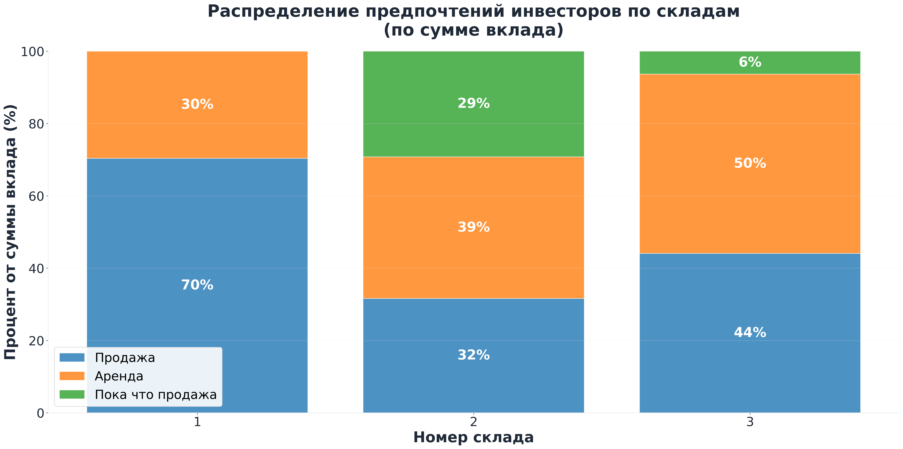
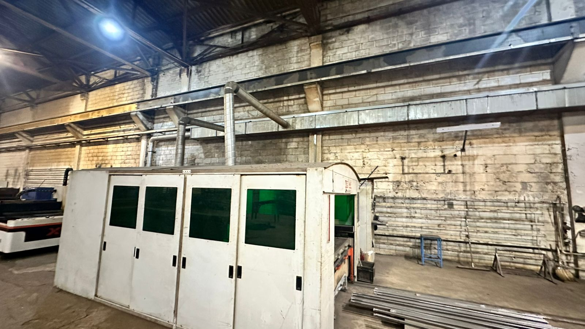
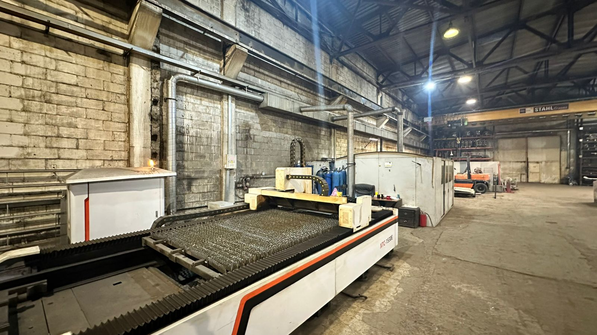
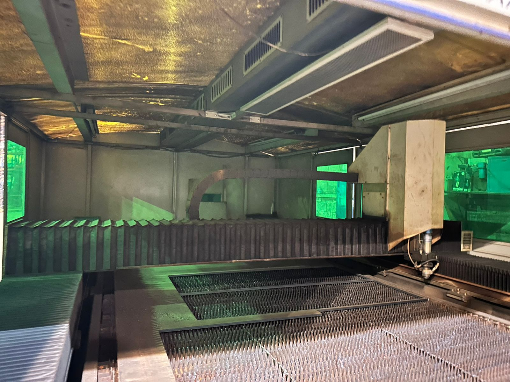

# 📊 Отчет по итогам опроса инвесторов
## Проект Фрязино • Ноябрь 2025

**Команда Redevest**
**Дата:** 27 ноября 2025

---

# 🎯 Введение

**Цель опроса:** собрать обратную связь инвесторов о дальнейшей стратегии развития проекта Фрязино

**Вопрос:** Какой путь развития выбрать?
- **А:** Продавать как можно скорее с постепенным снижением цены
- **Б:** Сдать в аренду и получать доход до продажи по базовой цене

---

# 📈 Репрезентативность

## Статистика участия
- **Всего инвесторов:** 38 уникальных
- **Ответили:** 34 инвестора (89.5%)
- **Воздержались:** 4 инвестора (10.5%)

## Распределение по сумме вклада
- **Ответили:** 81.3% от общей суммы инвестиций
- **Воздержались:** 18.7% от общей суммы инвестиций

---

# 🆕 Выделение новой категории

На основе анализа комментариев инвесторов была выделена **дополнительная категория В**:

## Категория В: Пока что продавать, а в марте вернемся к вопросу
- **Продажа в приоритете** - основной фокус на быстрый выход со скидкой
- **Аренда как запасной вариант** - готовы рассмотреть аренду только если продажа не состоится в ближайшее время
- **Временная стратегия** - планируют пересмотреть решение в марте 2026 года

---

# 📊 Распределение ответов

По количеству инвесторов
| Категория | Количество | Процент |
|-----------|------------|---------|
| А (Продажа со скидкой) | 16 | 47.1% |
| Б (Аренда с последующей продажей) | 13 | 38.2% |
| В (Пока что продажа) | 5 | 14.7% |

По складам и суммам вложений

| Склад | А (Продажа) | Б (Аренда) | В (Гибрид) |
|-------|-------------|------------|------------|
| **Склад 1** | 73.1% | 26.9% | 0.0% |
| **Склад 2** | 31.6% | 39.2% | 29.2% |
| **Склад 3** | 44.1% | 49.6% | 6.3% |

---

---

# 🔄 Конфликт продажи и аренды

**Изначально** мы считали аренду и продажу несовместимыми:
- Когда склад сдан в аренду, в него уже не может заселиться потенциальный покупатель

**Теперь** мы нашли арендатора, готового на расторжение с уведомлением за 3 месяца:
- **Время на поиск покупателя** от подписания договора до переезда арендатора занимает **несколько недель**
- **Таким образом, дилемма уходит** - мы можем одновременно продавать и сдавать в аренду

#### **Важно:** Стадия переговоров начальная, поэтому мы не можем гарантировать, что проблема уже решена

---

# 👷 Арендатор

>
- Локация очень удобна для этого арендатора.
- Заезд планируется с декабря по февраль во все три склада.
- Кран-балка устанавливается за счет арендатора, при выезде демонтируется и увозится им.
- Забор также возводится за его счет.
- Согласованы арендные каникулы — 1 месяц.
- Страхование здания осуществляет собственник (мы).
- Офисную часть (АБК, душевая, раздевалка, комната приема пищи) строим совместно, как неотделимые улучшения: работы выполняет арендатор своими силами, материалы — поровну (~600 000 ₽, планируем учесть в арендных каникулах на второй месяц).
- Индексацию аренды пока не обсуждали: предлагаем начать с 10%, но не менее 7%.
- Уведомление о расторжении — 90 дней для обеих сторон.
- Платежи за газ и электричество — оплачивает арендатор.
- Вентиляция и электропроводка — выполняет арендатор; электрику просит предоставить.
- Пожарная сигнализация — обеспечивает собственник (мы).
- По электричеству: ТУ поданы, ждём информации по стоимости; оплачивают арендаторы, работы относятся к неотделимым улучшениям.

---

# 🚀 Корректировка стратегии продаж

- **Все склады:** начинаем дисконтировать цены (снижаем цены, увеличиваем комиссию)

- **Склады 1 и 2:** снимаем предложения по аренде
  - (если не получится с арендатором, готовым быстро съехать)

- **Склад 3:** остается в аренде И продаже
  - Имеет **наибольшую поддержку аренды** (49.6% по сумме вклада)

---

# 🎯 Заключение

## Краткосрочные действия (декабрь 2025):
- [ ] Корректируем ценовую политику согласно новым предпочтениям
- [ ] Активизируем работу с покупателями по складам 1 и 2
- [ ] Мониторим отклик на новые цены

## Среднесрочные действия (январь-февраль 2026):
- [ ] Мониторим результаты продаж с новой стратегией
- [ ] При необходимости пересматриваем подход к складу 3
- [ ] Актуализируем ожидания по срокам выхода из проекта
