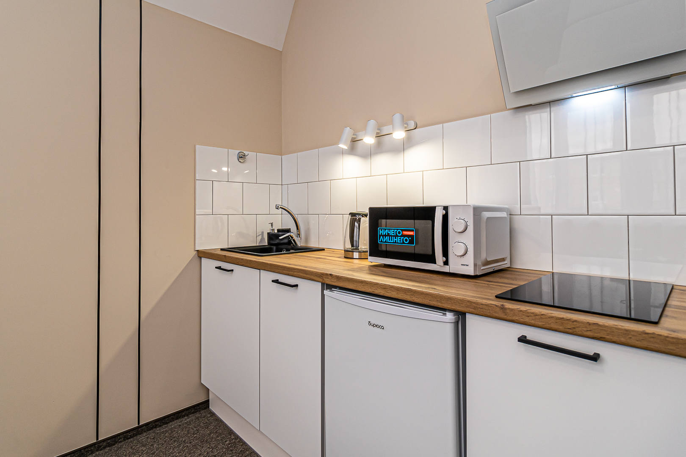
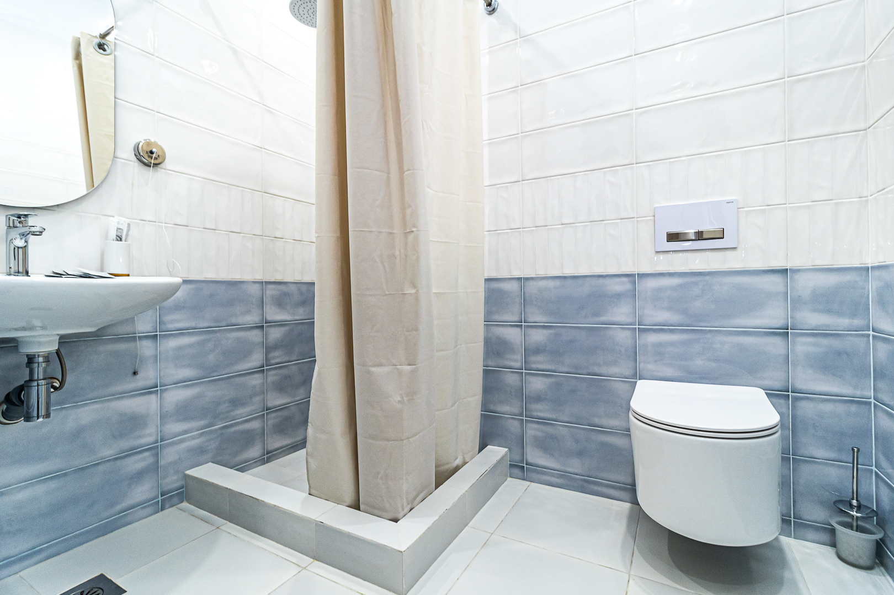
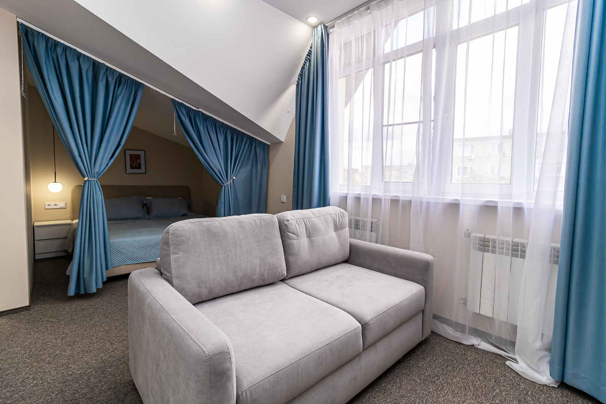
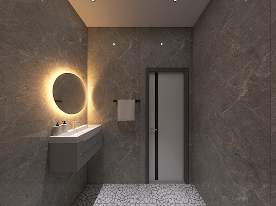
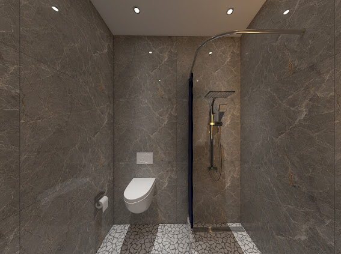

[[gallery]]

[[/gallery]]

[[project-passport]]
## Паспорт проекта
- **📍 Расположение:** г. Приморско-Ахтарск, Азовское море, **первая береговая линия**
- **🏨 Формат:** СПА-отель, номерной фонд в управлении УК
- **✅ Статус:** отель работает, приносит доход
- **⭐ Рейтинг:** **4.7 / 5.0** — 144 отзыва на Яндекс.Картах
- **🏢 Управление:** профессиональная УК Maris
[[/project-passport]]

[[callout | accent]]
Отель «Ахтари» — СПА-отель на первой береговой Азовского моря в Приморско-Ахтарске. Инвестиция в готовый бизнес: покупка номера, передача в управление, ежемесячный доход и потенциальный рост стоимости номера.
[[/callout]]

## Сейчас доступно: выход первого инвестора

Первый инвестор проекта, **Александр Иванов**, принял решение выйти. Он вошёл в проект в декабре 2023, приобрёл номер-люкс, получал доход от аренды. Теперь этот номер доступен по цене **на 28–39% ниже рынка**.

### Номер 32 — Люкс, 31.2 м²

| Параметр | Значение |
| --- | --- |
| **Цена** | **6 500 000 ₽** — полная, с ремонтом, мебелью и оборудованием |
| **Доход за 10 мес.** (июль 2025 — апрель 2026) | **504 190 ₽** чистыми, после комиссии УК |
| **Среднемесячный доход** | **~50 000 ₽/мес** |
| **Средняя загрузка** | 78–100% в сезон |

### Сравнение с рынком

[[callout | success]]
**Компаративы (номера в том же отеле):**
- Room 4 — продана за **8,35 млн ₽**
- Room 30 — продана за **8,85 млн ₽**
- Room 35 — продана за **~9,05 млн ₽**
- Room 32 в каталоге — **9,36 млн ₽**

**Ваша скидка к рынку: 28–39%**
[[/callout]]

### Сценарии доходности

[[toggle | Сценарий 1: вход с перепродажей в течение года]]
Покупаете номер за **6,5 млн ₽**, продаёте в течение года по рынку (≈8,5–9 млн).

- Ожидаемая чистая прибыль: **~2,0–2,5 млн ₽**
- Годовая доходность: **~30–40%** с учётом арендного дохода за период

[[toggle | Сценарий 2: удержание и арендный доход]]
Покупаете номер за **6,5 млн ₽**, получаете арендный доход.

- Среднемесячный доход: **~50 000 ₽**
- Капитализация: **~8,8% годовых**
- Доход без управления — всё делает УК Maris

[[toggle | Сценарий 3: сочетание — аренда и плановая продажа через 2–3 года]]
- Арендный доход за 2 года: **~1,2 млн ₽**
- Рост стоимости номера: **+10–15%**
- Совокупная доходность: **~25–35% годовых**

### Комиссионные

Комиссия за закрытие сделки — **500 000 ₽**. Приоритет у того, кто первый приводит покупателя — сплита нет.

## Об отеле

СПА-отель «Ахтари» расположен в городе Приморско-Ахтарск — курорте на Азовском море. Первая береговая линия, развитая инфраструктура, высокий туристический поток.

**Ключевые преимущества:**
- Первая береговая линия — прямой выход к пляжу
- Профессиональное управление — УК Maris с прозрачной отчётностью
- Высокий сезонный спрос — загрузка до 100% в пик
- Положительные отзывы гостей — рейтинг 4.7 на Яндекс.Картах
- Бассейны, сауны, спа, рестораны на территории

[[iframe | https://www.youtube.com/embed/EILUT3NAYjw]]

## Как устроен доход

1. **Вы покупаете номер** — полностью готовый: ремонт, мебель, техника, подключение к системе бронирования.
2. **УК Maris управляет номером** — бронирования, заселение, уборка, обслуживание. Вы получаете ежемесячные отчёты и выплаты.
3. **Вы получаете доход** — от аренды (ежемесячно) и от продажи номера (при выходе).

## Как зайти в сделку

1. **Бот:** пройдите идентификацию — откроются документы по номеру: выписка ЕГРН, финмодель, отчёты УК, образец ДКП.
2. **Проверка:** сверьте расчёты, изучите документы сами или с консультантом.
3. **Сделка:** аванс → проверка → подписание ДКП — полный месяц на процедуры.

## Ответы на вопросы

[[toggle | Что именно я покупаю?]]
Номер 32 (люкс, 31.2 м²) в СПА-отеле «Ахтари», г. Приморско-Ахтарск. В стоимость входит ремонт, мебель, оборудование — номер готов к сдаче.

[[toggle | Кто управляет отелем?]]
Профессиональная управляющая компания Maris. Она занимается бронированием, заселением, уборкой, обслуживанием. Вы получаете ежемесячные отчёты и выплаты.

[[toggle | Какой доход приносит номер?]]
За 10 месяцев работы (июль 2025 — апрель 2026) номер принёс 504 190 ₽ чистыми. Среднемесячный доход — ~50 000 ₽. Доход зависит от сезона и загрузки.

[[toggle | Можно ли пользоваться номером самому?]]
Да, до 30 дней в год — бесплатно.

[[toggle | Какие риски?]]
Доходность зависит от туристического сезона, загрузки отеля и ставок аренды. Нет гарантии срока и цены при перепродаже. Перед покупкой изучите документы и финмодель в боте.

[[toggle | Кто участвует в сделке?]]

| Сторона | Роль |
| --- | --- |
| **Александр Иванов** | Продавец номера (первый инвестор) |
| **Вы** | Покупатель |
| **Редевест** | Представляет интересы инвесторов, материалы по сделке |
| **УК Maris** | Управление номером после покупки |
