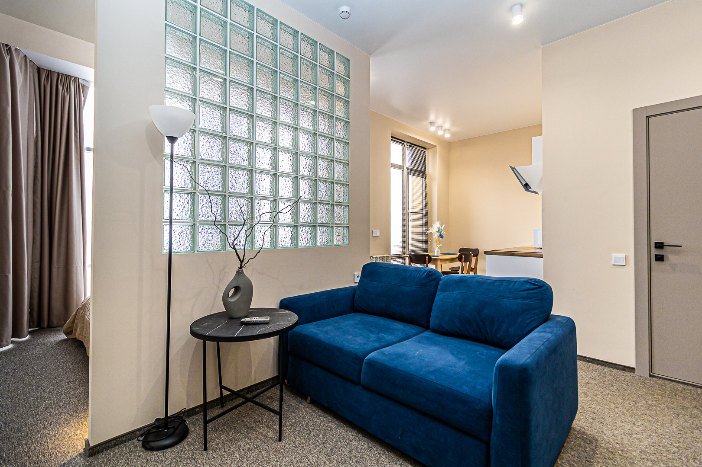
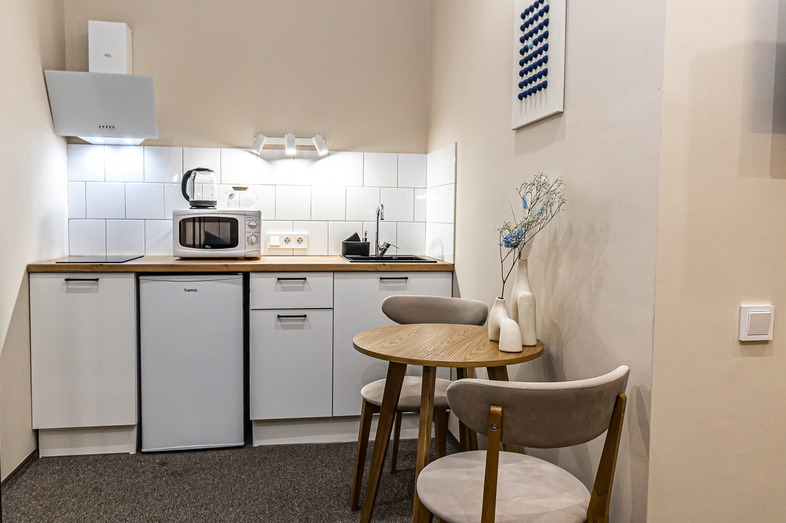
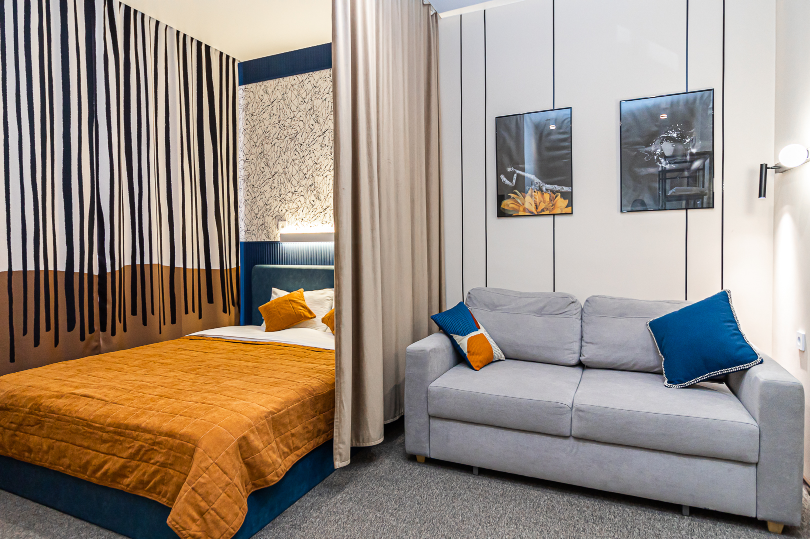
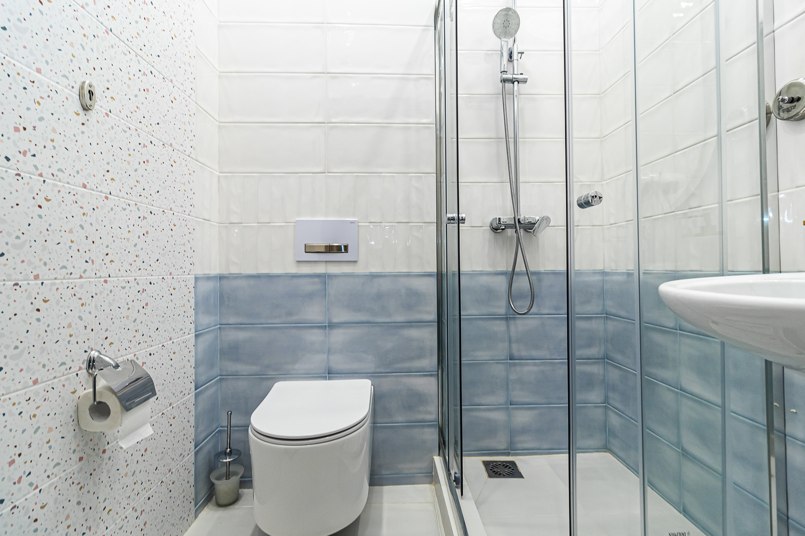
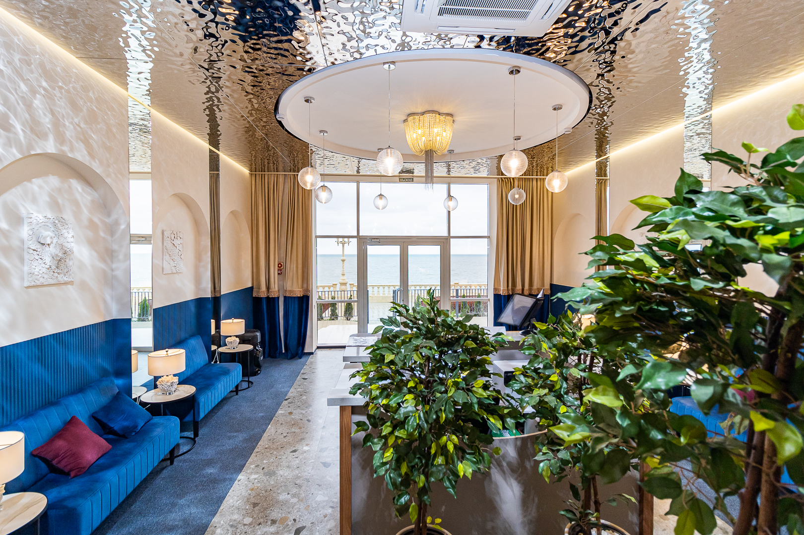
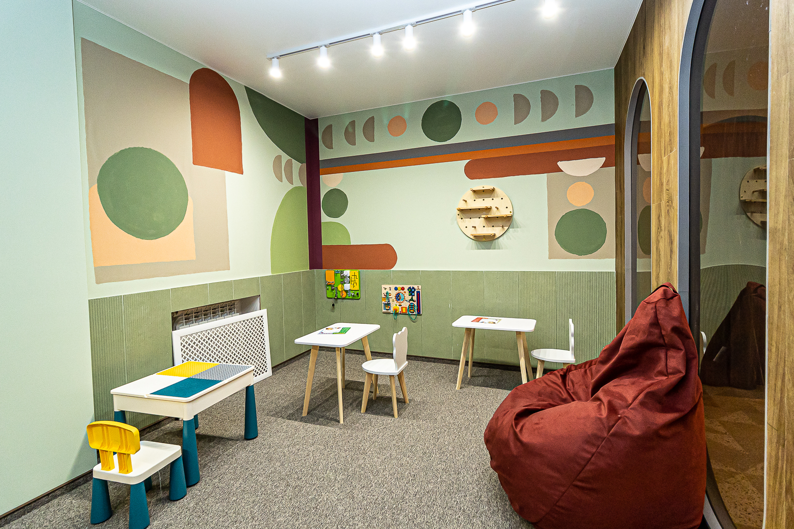
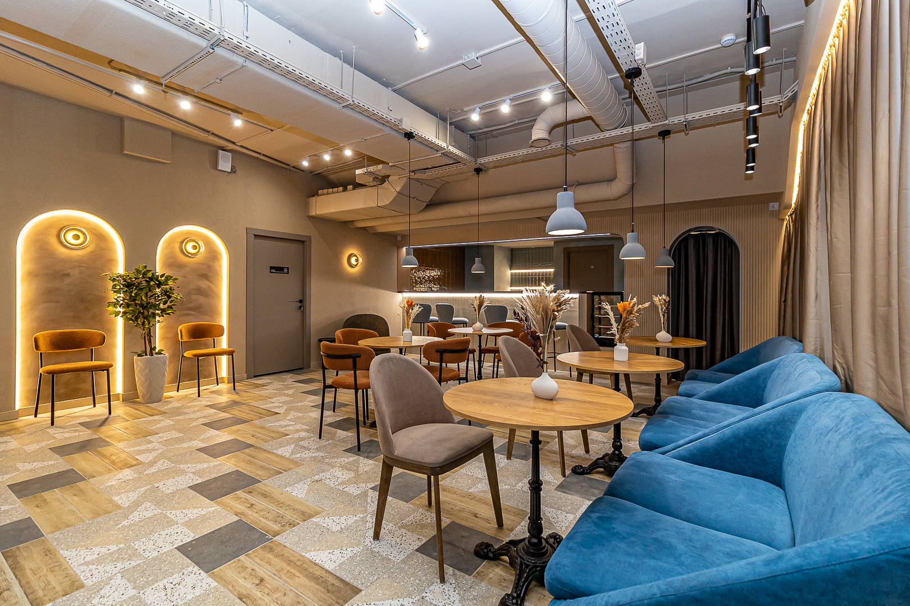
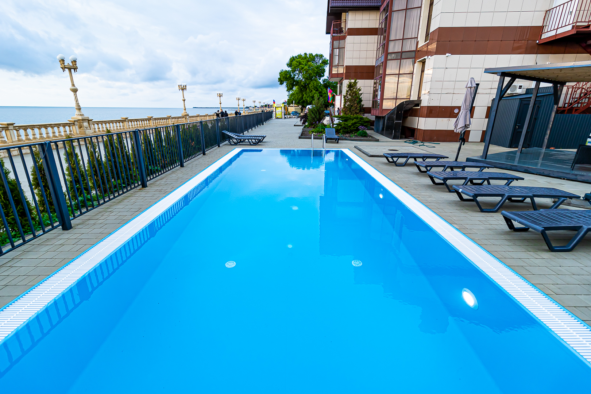
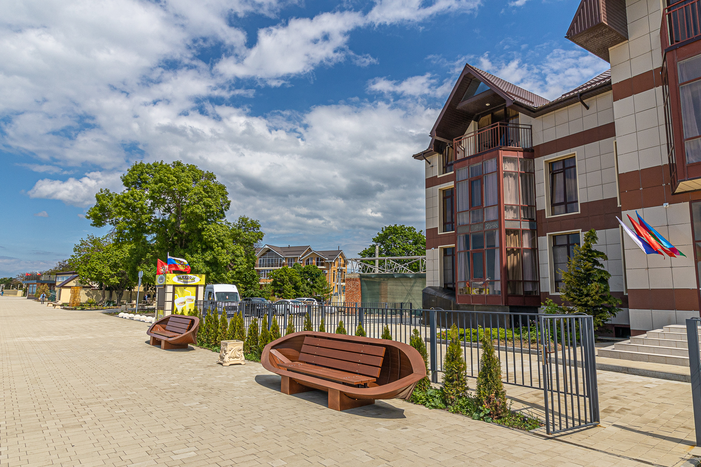
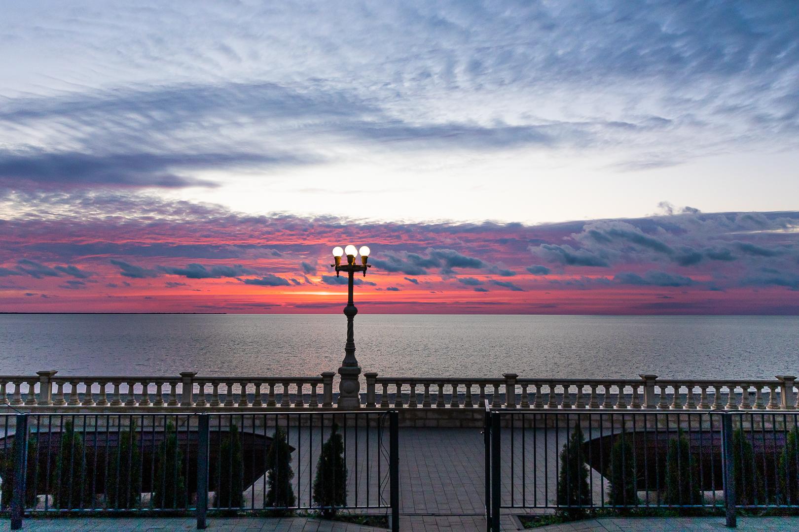

[[gallery]]

[[/gallery]]

[[project-passport]]
## Паспорт проекта
- **📍 Расположение:** г. Приморско-Ахтарск, Азовское море, **первая береговая линия**
- **🏨 Формат:** СПА-отель, номерной фонд в управлении УК
- **✅ Статус:** отель работает, приносит доход
- **⭐ Рейтинг:** **5.0** — 146 отзывов, 259 оценок на Яндекс.Картах
- **🗺️ [Яндекс.Карты](https://yandex.ru/maps/-/CPtAv26R)** — 313 фото, рейтинг 5.0
- **🏢 Управление:** профессиональная УК Maris
[[/project-passport]]

[[callout | accent]]
Отель «Ахтари» — СПА-отель на первой береговой Азовского моря в Приморско-Ахтарске. Инвестиция в готовый бизнес: покупка номера, передача в управление, ежемесячный доход и потенциальный рост стоимости номера.
[[/callout]]

## Сейчас доступно: выход первого инвестора

Первый инвестор проекта принял решение выйти — номер-люкс доступен **на 28–39% ниже рынка**.

**Номер 32 — Люкс, 31.2 м²**  
Цена: **6 500 000 ₽** — полная, с ремонтом, мебелью и оборудованием. Номер готов к сдаче, под управлением УК Maris.

➡️ **Финмодель, выписка ЕГРН, отчёты УК и условия сделки — в боте.**

## Об отеле

СПА-отель «Ахтари» расположен в городе Приморско-Ахтарск — курорте на Азовском море. Первая береговая линия, развитая инфраструктура, высокий туристический поток.

**Ключевые преимущества:**
- Первая береговая линия — прямой выход к пляжу
- Профессиональное управление — УК Maris с прозрачной отчётностью
- Высокий сезонный спрос — загрузка до 100% в пик
- Положительные отзывы гостей — рейтинг 5.0 на [Яндекс.Картах](https://yandex.ru/maps/-/CPtAv26R)
- Бассейны, сауны, спа, рестораны на территории

[[iframe | https://www.youtube.com/embed/EILUT3NAYjw]]

## Ответы на вопросы

[[toggle | Что именно я покупаю?]]
Номер 32 (люкс, 31.2 м²) в СПА-отеле «Ахтари», г. Приморско-Ахтарск. В стоимость входит ремонт, мебель, оборудование — номер готов к сдаче.

[[toggle | Кто управляет отелем?]]
Профессиональная управляющая компания Maris. Она занимается бронированием, заселением, уборкой, обслуживанием. Ежемесячные отчёты — в боте.

[[toggle | Можно ли пользоваться номером самому?]]
Да, до 30 дней в год — бесплатно.
