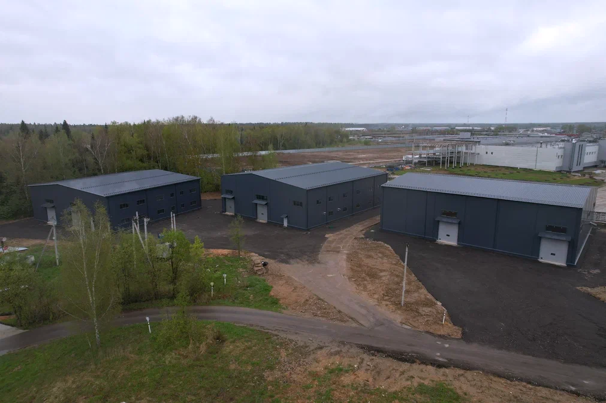
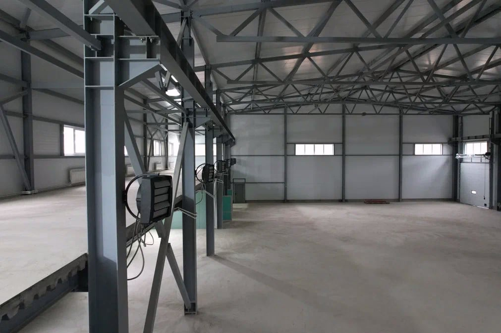
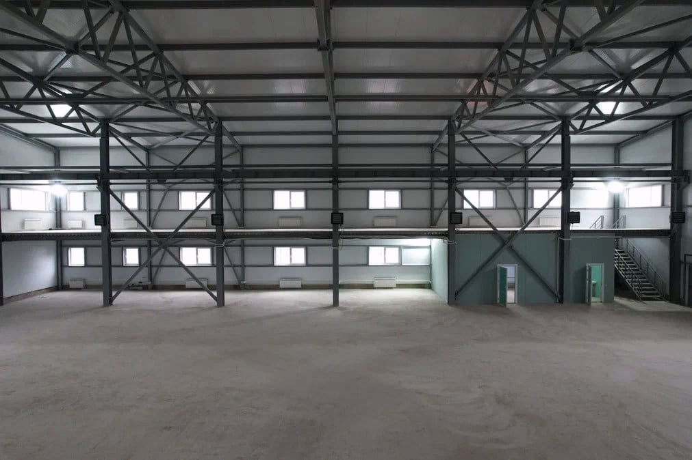
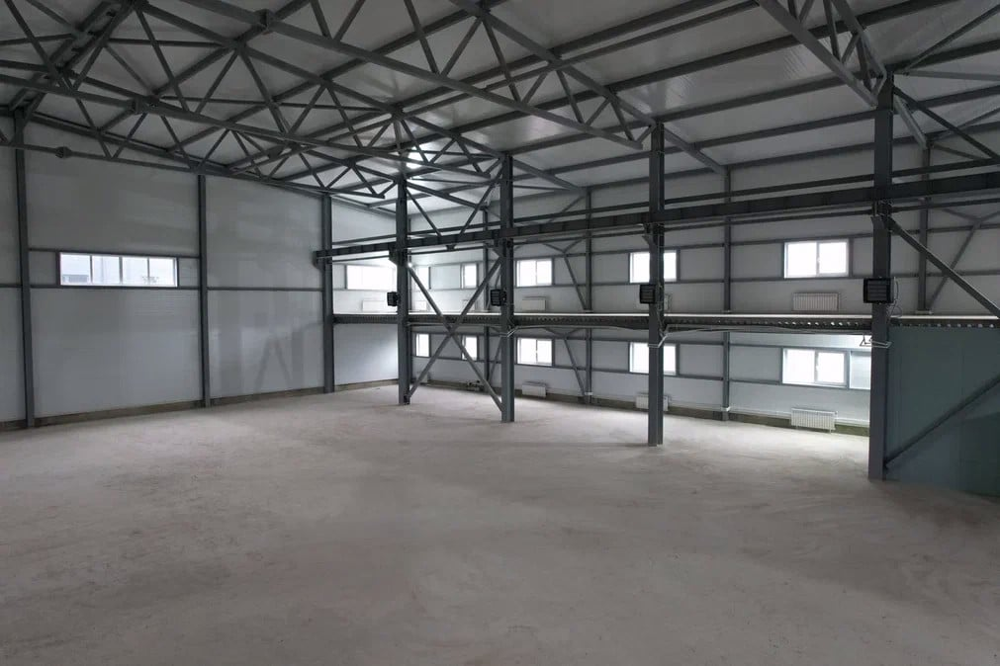

## Почему это может быть выгодно сейчас

- Вход в часть лотов идет с дисконтом к целевым ориентирам 91–99 тыс. ₽/м²
- Объект уже построен: это снижает девелоперские риски по сравнению с «котлованом»
- Есть выбор стратегии: держать под аренду, перепродать долю, выйти при продаже склада целиком

## Почему этот проект стоит смотреть

- Вы покупаете долю в реальном складском активе, а не обещание «будущего проекта».
- По ряду лотов вход ниже целевого диапазона — это дает запас по цене на выходе.
- Можно выбрать удобный сценарий: арендый доход, перепродажа доли или выход при продаже склада целиком.

[[project-passport]]
## Паспорт проекта

[[gallery]]

[[/gallery]]

- **📍 Локация:** МО, Щёлково, 29 км от МКАД
- **Формат:** складской комплекс класса B (3 корпуса)
- **Склад 1:** 1045 м² 
- **Склад 2:** 1257 м² 
- **Склад 3:** 1257 м² (сдан в аренду ООО «Полимер-сервис», 700 ₽/м², 11 месяцев)
- **Электричество:** 50+ кВт на склад, с возможностью увеличения
- **Статус земли:** межевание выполнено, участок в собственности
- **Целевые цены продажи складов целиком:** 95–124 млн ₽
- **Целевая аренда:** 800–1000 ₽/м²

**Плюсы локации:**
- Кластер Фрязино — Щёлково — Пушкино — Мытищи (высокая концентрация складов и производств)
- Удобная транспортная доступность для грузового транспорта
- Хорошая логистика: свободный заезд и выезд фур
- Развитая промышленная инфраструктура
- Близость к Москве и ключевым магистралям Московской области

**Характеристики складов:**
- Высота потолков 8 м (стеллажи в 2–3 яруса)
- Направляющие под кран-балку до 5 т
- Усиленный бетонный пол
- Ворота на уровне пола
- Собственные септики и скважины
- Отопление: тепловые пушки + конвекторы
- По 2 мокрые точки в каждом складе
- Офисные помещения по 100 м²

**Преимущества проекта:**
- Готовый актив, не стадия котлована
- Качественное строительство подтверждено экспертизой
- Понятная логика выхода: аренда, перепродажа доли, продажа склада целиком

[[/project-passport]]

---

## Что получает инвестор

- Долю в конкретном готовом складе, а не абстрактную «идею»
- Привязку к реальному активу с понятной локацией и техпараметрами
- Возможность выбрать стратегию: аренда и выход, перепродажа доли, ожидание продажи склада
- Прозрачную точку входа: доля, сумма, ориентир цены за м²

## Доходность и сценарии

Проект предлагает вход в реальные доли готовых складов по ценам ниже целевого диапазона 91–99 тыс. ₽/м². Ниже — базовая математика потенциал роста цены по текущим лотам.

| Лот | Текущая цена, ₽/м² | Потенциал до 91 тыс. ₽/м² | Потенциал до 99 тыс. ₽/м² |
|-----|---------------------|---------------------------|---------------------------|
| №1 (лучший вход) | 66 200 | +37,5% | +49,5% |
| №1 | 73 600 | +23,6% | +34,5% |
| №3 | 85 000 | +7,1% | +16,5% |
| №3 | 87 500 | +4,0% | +13,1% |

Это не гарантированная доходность, а расчет потенциала при выходе в целевой диапазон цен по складам.

| Сценарий | Что делает инвестор | На чем зарабатывает |
|----------|---------------------|---------------------|
| Консервативный | Входит в долю в складе с арендаторами/арендным фокусом | Арендный поток + последующая продажа |
| Сбалансированный | Входит с дисконтом к целевой цене склада | Сужение дисконта + рост ликвидности |
| Доходный | Покупает долю с сильным дисконтом | Перепродажа доли по более высокой цене |

## Арендный сценарий

Для инвестора, который рассматривает не только перепродажу доли, но и денежный поток от аренды, важны три опорные точки:

- Склад №3 уже сдан в аренду, что подтверждает рабочий спрос на объект.
- По складу №2 выбран арендный фокус, это повышает вероятность стабильного потока.
- Целевая ставка по проекту 800–1000 ₽/м² создает потенциал роста относительно текущих входных условий.

**Инвестор заходит в долю по цене ниже целевого диапазона, получает арендный поток и имеет опцию выхода по мере роста ликвидности.**

## Что можно купить на разный бюджет

Ниже ориентиры, чтобы сразу понять «что я получу за свои деньги»:

| Бюджет | Что обычно можно взять | Ориентир по доле | Рабочая стратегия |
|--------|-------------------------|------------------|-------------------|
| ~3 млн ₽ | Точка входа в один из минимальных лотов | 2,5–3,0% | Заход с дисконтом и перепродажа доли при росте цены |
| ~4,5 млн ₽ | Средняя доля в лотах с сильным дисконтом | около 6,5% | Сбалансированный сценарий: дисконт + опцион на аренду/выход |
| ~6 млн ₽ | Более крупная доля в ликвидных лотах | около 5,0% (в более дорогом складе) | Комбинация: арендный поток + выход по целевой цене |

## Актуальные предложения по долям

Самые интересные лоты по цене входа:

| Место | Склад | Доля   | Сумма          | ≈ Цена за м² |
|-------|-------|--------|----------------|--------------|
| 1     | №1    | 6,5%   | 4 500 000 ₽   | **66 200 ₽** |
| 2     | №1    | 6,5%   | 4 500 000 ₽   | **66 200 ₽** |
| 3     | №1    | 6,5%   | 5 000 000 ₽   | 73 600 ₽    |
| 4     | №3    | 5,0%   | 5 330 000 ₽   | 85 000 ₽    |
| 5     | №3    | 5,0%   | 5 500 000 ₽   | 87 500 ₽    |
| 6     | №2    | 2,5%   | 3 000 000 ₽   | 95 500 ₽    |
| 7     | №2    | 5,0%   | 6 100 000 ₽   | 97 000 ₽    |

Все цены ниже целевых ориентиров продажи складов целиком (91–99 тыс. ₽/м²), что формирует запас входа.

## Риски и ограничения

- **Ликвидность долей:** сроки выхода зависят от спроса и цены входа
- **Арендные риски:** ставка и сроки могут меняться
- **Сроки улучшений:** дооборудование и ремонт влияют на момент выхода в целевой режим

## Что дальше

- Завершение дооборудования и выход склада №3 в полноценную эксплуатацию.
- Поиск арендаторов на склад №2 по целевой ставке.
- Продолжение работы по рынку долей (обмены между инвесторами + привлечение внешних покупателей).
- Завершение ремонта на складе №1.

Если хотите понять ваш сценарий и доходность по конкретным лотам, напишите в бот — подготовим персональный расчет.
