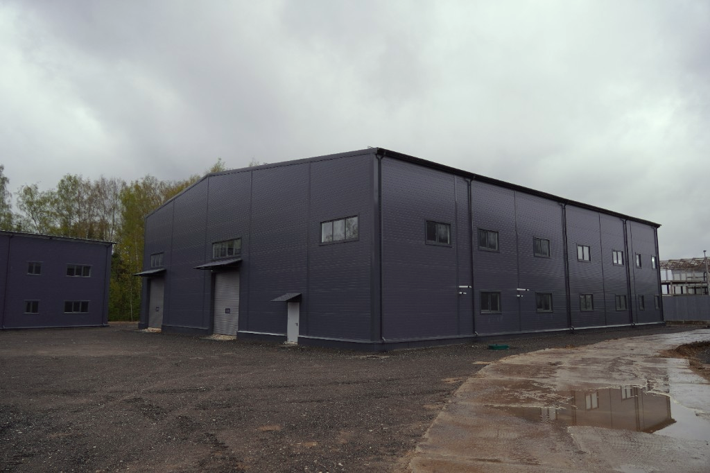
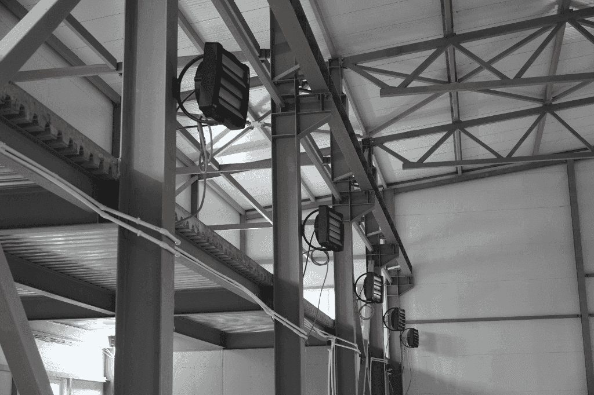
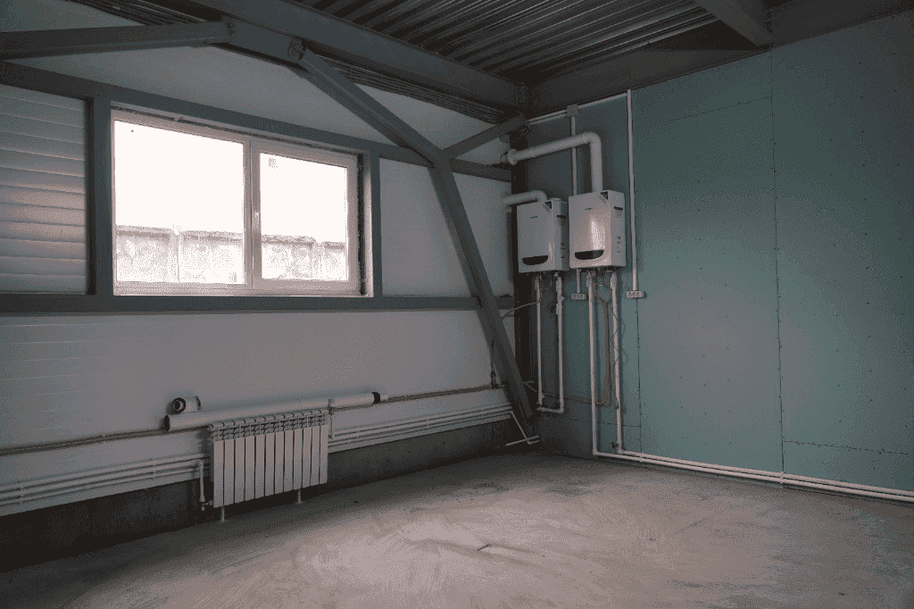
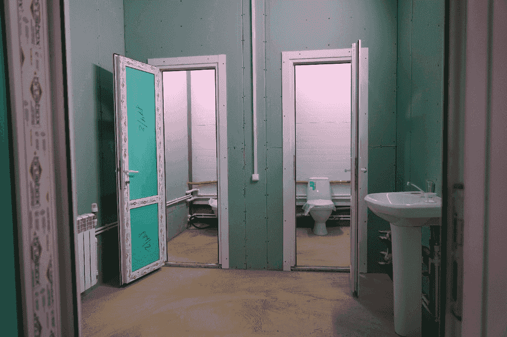
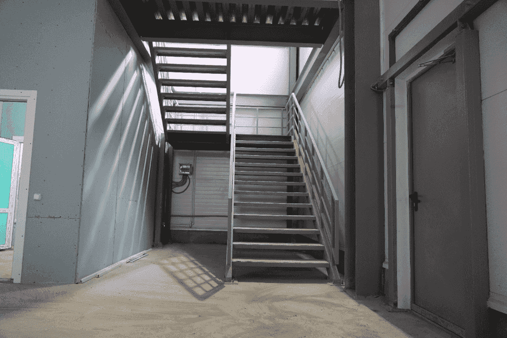
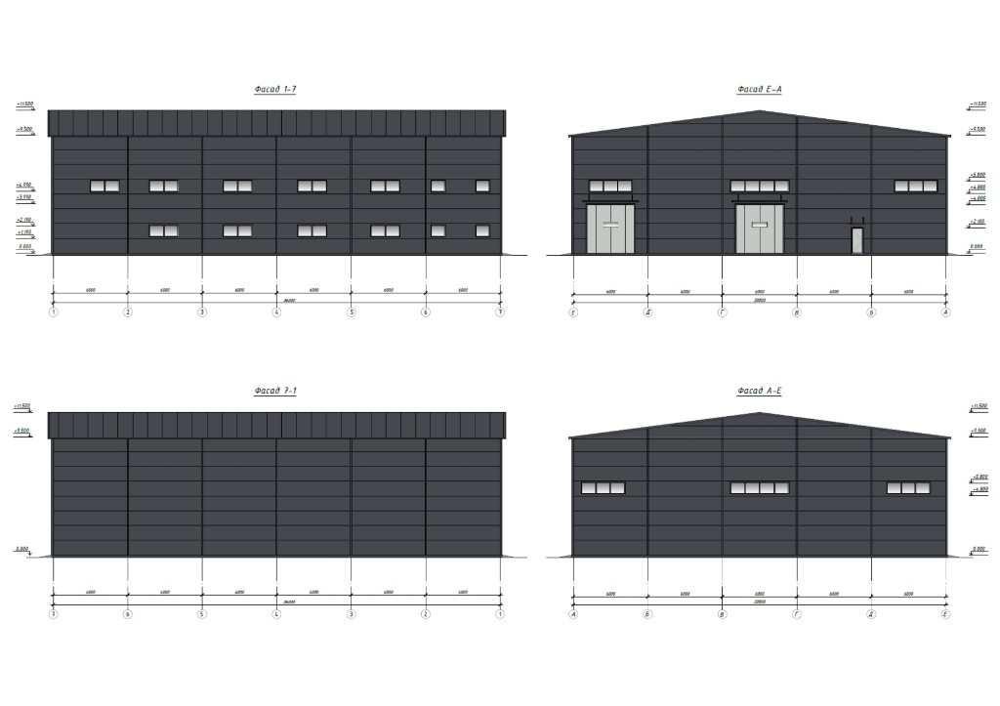
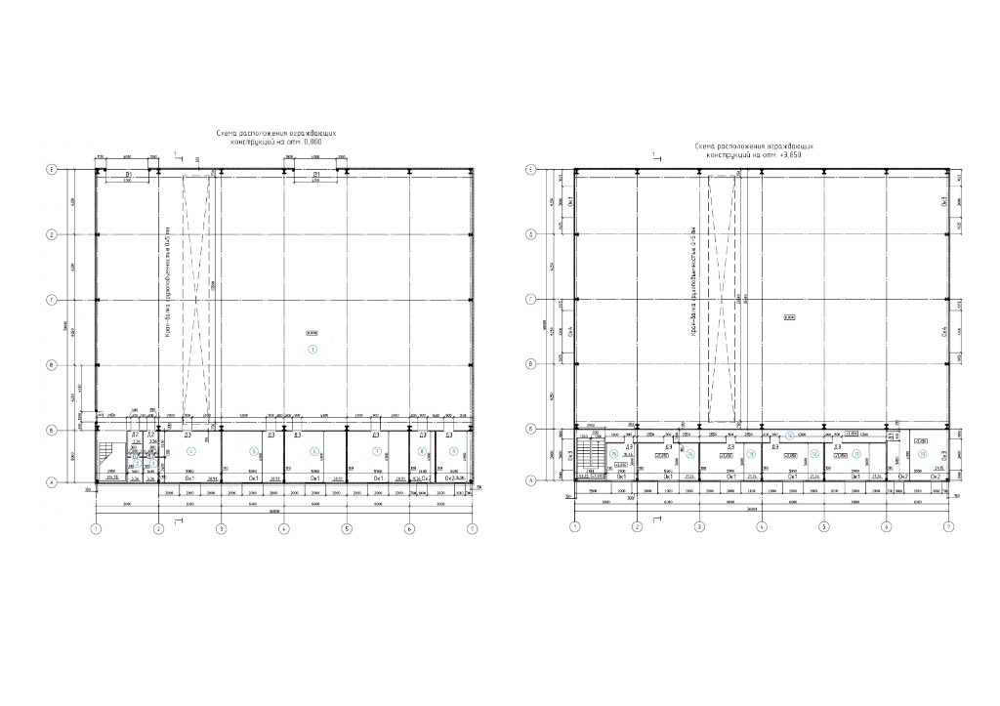
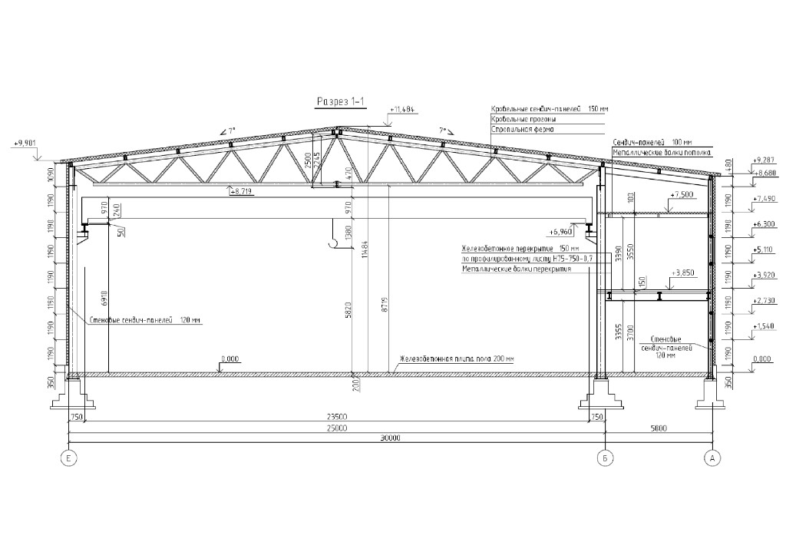

[[project-passport]]
## Паспорт проекта
- **📍 Локация:** МО, Щёлково, 29 км от МКАД

[[gallery]]

[[/gallery]]

- **Формат:** готовый склад класса B (площадь 1257 м²)
- **Актив для входа:** склад №3 (сдан в аренду ООО «Полимер-сервис», 700 ₽/м², 11 месяцев)
- **Цена входа:** от 5,33 млн ₽ за долю
- **Статус земли:** межевание выполнено, участок в собственности
- **Целевая цена продажи склада целиком:** 119 млн ₽

**Ориентиры по доходности**  
Потенциал роста цены доли до 95 тыс. ₽/м²: до **+12,0%**  
Потенциал роста цены доли до 99 тыс. ₽/м²: до **+16,7%**  
Доход формируется из двух источников: арендный поток и рост цены доли при выходе

[[/project-passport]]

## Подтверждение опыта фонда

- Эти доли - это заявки действующих участников проекта, которые входили в сделку на этапе строительства.
- В проект Фрязино на этапе стройки вошли **38 инвесторов**.
- По опросу о стратегии выхода некоторые из них выбрали уступку доли. Именно из этого пула сформированы текущие предложения по долям.
- В основном канале фонда — 8 500+ подписчиков и регулярные обновления по проектам в каналах хода работ.

---

## Что получает инвестор

- Долю в конкретном готовом складе с действующим арендатором
- Привязку к реальному активу с понятной локацией и техпараметрами
- Возможность выбрать стратегию: доход от аренды, перепродажа доли, выход при продаже склада
- Прозрачную точку входа: доля, сумма, ориентир цены за м²

## Доходность и сценарии

Проект предлагает вход в доли готового склада по ценам ниже целевого диапазона 95–99 тыс. ₽/м². 
Ниже — расчет потенциала роста цены по текущим лотам.

| Лот | Текущая цена, ₽/м² | Потенциал до 95 тыс. ₽/м² | Потенциал до 99 тыс. ₽/м² |
|-----|---------------------|---------------------------|---------------------------|
| Лот 1 (лучший вход) | 84 800 | +12,0% | +16,7% |
| Лот 2 | 87 500 | +8,6% | +13,1% |

Все лоты в этом блоке относятся к складу №3. Это не гарантия доходности, а расчет потенциала при выходе в целевой диапазон цен по складу.

| Сценарий | Что делает инвестор | На чем зарабатывает |
|----------|---------------------|---------------------|
| Консервативный | Входит в долю в складе с действующим арендатором | Арендный поток + последующая продажа |
| Сбалансированный | Входит с дисконтом к целевой цене склада | Сужение дисконта + рост ликвидности |
| Доходный | Покупает долю с сильным дисконтом | Перепродажа доли по более высокой цене |

## Расчет совокупной доходности (аренда + продажа)

Ниже пример для лота **5,0% за 5 330 000 ₽** (вход **84 800 ₽/м²**) на горизонте **24 месяца**.

<table>
  <thead>
    <tr>
      <th>Сценарий</th>
      <th>Доход от аренды за 24 мес</th>
      <th>Доход от продажи доли</th>
      <th>Совокупная доходность за 24 мес</th>
      <th>Годовая доходность</th>
    </tr>
  </thead>
  <tbody>
    <tr>
      <td>Консервативный</td>
      <td>+16,0%</td>
      <td>+12,0%</td>
      <td><strong>+28,0%</strong></td>
      <td><strong>14,0%</strong></td>
    </tr>
    <tr>
      <td>Базовый</td>
      <td>+20,0%</td>
      <td>+14,4%</td>
      <td><strong>+34,4%</strong></td>
      <td><strong>17,2%</strong></td>
    </tr>
    <tr>
      <td>Оптимистичный</td>
      <td>+24,0%</td>
      <td>+16,7%</td>
      <td><strong>+40,7%</strong></td>
      <td><strong>20,4%</strong></td>
    </tr>
  </tbody>
</table>

Это расчетный ориентир для проверки логики, а не гарантия доходности.

## Арендный сценарий

Для инвестора, который рассматривает не только перепродажу доли, но и денежный поток от аренды, важны три момента:

- Склад №3 уже сдан в аренду, что подтверждает спрос на объект.
- Доходность формируется не только ростом цены доли, но и арендным потоком.
- Целевая ставка по проекту 800–1000 ₽/м² создает потенциал роста относительно текущих входных условий.

**Инвестор заходит в долю по цене ниже целевого диапазона, получает арендный поток и имеет опцию выхода по мере роста ликвидности.**

## Что можно купить на разный бюджет

Ниже ориентиры, чтобы сразу понять «что я получу за свои деньги»:

| Бюджет | Что обычно можно взять | Ориентир по доле | Рабочая стратегия |
|--------|-------------------------|------------------|-------------------|
| ~5,3–5,5 млн ₽ | Базовая точка входа в склад №3 | 5,0% | Сбалансированный сценарий: аренда + выход по целевой цене |
| ~6,1 млн ₽ | Лот с более высокой ценой входа | 5,0% | Приоритет дохода от аренды, затем выход при росте цены |
| ~7,5 млн ₽ | Более крупный пакет в одном лоте | около 6,0% | Консервативный сценарий с запасом по сроку |

## Актуальные предложения по долям

Самые интересные лоты по цене входа:

| Место | Склад | Доля   | Сумма          | ≈ Цена за м² |
|-------|-------|--------|----------------|--------------|
| 1     | №3    | 5,0%   | 5 330 000 ₽   | **84 800 ₽** |
| 2     | №3    | 5,0%   | 5 500 000 ₽   | 87 500 ₽    |
| 3     | №3    | 5,0%   | 5 500 000 ₽   | 87 500 ₽    |
| 4     | №3    | 5,0%   | 5 500 000 ₽   | 87 500 ₽    |

Все цены сопоставимы или ниже целевых ориентиров продажи склада целиком (95–99 тыс. ₽/м²), что дает запас по цене входа в части лотов.

## Безопасность и структура сделки

- **Кто ведет проект и какой у него опыт.** Проект ведет инициатор, который уже довел этот объект до результата: складской комплекс из трех корпусов построен и введен в эксплуатацию. На текущем этапе инициатор сопровождает объект операционно (доработки под арендатора, запуск арендного потока и подготовка сделок по долям). Текущие предложения сформированы из долей участников, вошедших на этапе строительства и выбравших сценарий уступки доли.
- **Документы по объекту (кадастр/ЕГРН).** Это вход в долю реального актива, а не займ под залог. База сделки — склад и земельный участок: участок в собственности, межевание выполнено, правовой статус подтверждается документами. Точные кадастровые номера и выписки ЕГРН выдаются в боте по конкретному лоту после запроса инвестора.
- **Запас по стоимости актива относительно цены входа.** Соотношение цены входа к стоимости актива рассчитывается индивидуально по выбранной доле, с привязкой к документам по объекту и параметрам конкретной сделки.

## Техническая документация по объекту

## Видеопрезентация склада

<video controls preload="metadata" style="width: 100%; border-radius: 12px;">
  <source src="../assets/fryazino-presentation.mp4" type="video/mp4">
  Ваш браузер не поддерживает воспроизведение видео.
</video>

## Риски и ограничения

- **Ликвидность долей:** сроки выхода зависят от спроса и цены входа
- **Арендные риски:** ставка и сроки могут меняться
- **Сроки улучшений:** дооборудование и ремонт влияют на момент выхода в целевой режим

## Девелоперский проект

Инициатор построил и ввёл в эксплуатацию складской комплекс класса В из трех складов общей площадью 3559,5 м².

### Преимущества проекта:

- Склад №3 уже построен и введен в эксплуатацию — это снижает строительные риски для нового инвестора.
- Вход по ряду лотов идет ниже целевых ориентиров 95–99 тыс. ₽/м², что формирует запас по цене на выходе.
- Для инвестора доступны несколько сценариев: арендный поток, уступка доли или выход через продажу актива.

### Статус проекта

- Склад сдан. Сейчас делаем дооборудование по запросу арендатора: перегородки на антресолях и под ними (комнаты отдыха, кабинет, складские помещения)
— Потом каникулы до 30 дней на переезд
— После переезда начинаются платежи по договору аренды

### Плюсы локации:
- Кластер Фрязино — Щёлково — Пушкино — Мытищи (высокая концентрация складов и производств)
- Удобная транспортная доступность для грузового транспорта
- Хорошая логистика: свободный заезд и выезд фур
- Развитая промышленная инфраструктура
- Близость к Москве и ключевым магистралям Московской области

### Характеристики склада:
- Электричество: 50+ кВт, с возможностью увеличения под задачи арендатора.
- Высота потолков 8 м (стеллажи в 2–3 яруса)
- Направляющие под кран-балку до 5 т
- Усиленный бетонный пол
- Ворота на уровне пола
- Собственные септики и скважины
- Отопление: тепловые пушки + конвекторы
- 2 мокрые точки
- Офисные помещения по 100 м²

## Путь инвестора - что делать дальше?

1. Выбираете интересующий лот и оставляете заявку в боте.
2. Получаете пакет материалов по объекту и персональный расчет.
3. Общаетесь с менеджером.
4. Принимаете решение по сделке и переходите к оформлению.

## Доказательная база для инвестора

- Персональный расчет доходности под ваш бюджет и срок
- Актуальный список лотов и структура сделки по складу №3
- Финмодель и дорожная карта реализации
- Документы по объекту и юридической структуре
- Возможность сразу оставить заявку на звонок менеджеру

## Аналитика цен по лоту №3

Сравнение текущих цен входа с целевым диапазоном выхода по складу №3:

| Метрика | Значение |
|---------|----------|
| Минимальная текущая цена входа | 84 800 ₽/м² |
| Часто встречающаяся цена по лотам | 87 500 ₽/м² |
| Целевой диапазон выхода | 95 000–99 000 ₽/м² |
| Запас к нижней границе (95 000 ₽/м²) | +8,6% до +12,0% |
| Запас к верхней границе (99 000 ₽/м²) | +13,1% до +16,7% |

## Часто задаваемые вопросы

[[toggle | Кто такой Алексей Лещенко и Редевест?]]
Алексей Лещенко — основатель и CEO фонда Редевест, инвестор и управляющий партнер инвестиционных проектов. С 2020 года фонд инвестирует в склады, коттеджные поселки, отели, создание торговых ГАБов и флиппинг квартир. Команда Редевест ищет проекты, считает финмодели, оценивает риски и входит в проекты вместе с соинвесторами. В сообществе фонда — более 8 000 инвесторов, суммарный объем вложений превысил 1 млрд руб. В проектах Редевест отвечает за упаковку сделки, привлечение капитала и контроль интересов инвесторов.

[[toggle | Что именно я покупаю?]]
Долю в готовом складе №3 с понятной ценой входа и прозрачным набором документов.

[[toggle |Откуда формируется доход?]]
Из арендного потока и/или из роста цены доли при выходе.

[[toggle |Можно ли выйти из инвестиции раньше?]]
Выход зависит от цены входа, спроса на долю и выбранной стратегии.

[[toggle | Как контролируется ход проекта?]]
Фонд Редевест контролирует целевое использование средств и сроки проекта. Основная отчетность для инвесторов — в живом режиме в канале [Фрязино / склады — ход работ](https://t.me/fryazino_redevest).

**Если хотите понять ваш сценарий и доходность по конкретным лотам, напишите в бот — подготовим персональный расчет.**
