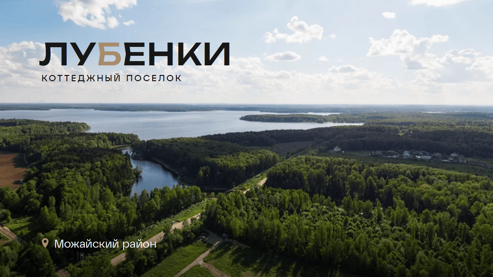
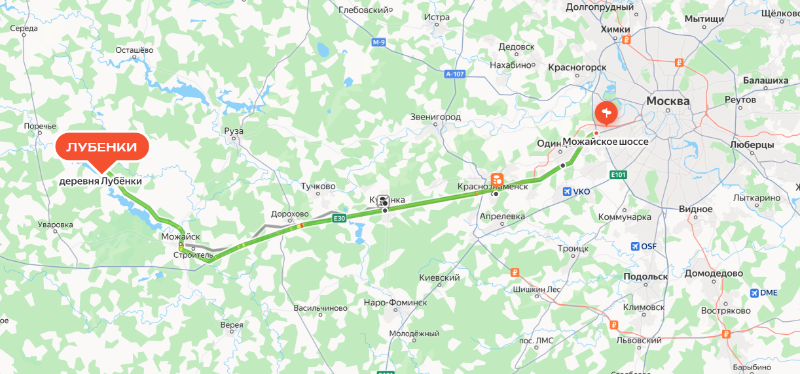
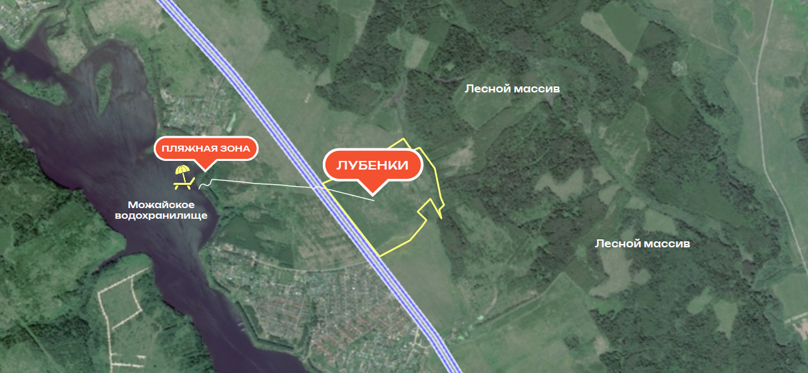

## Цель займа

Строительство коттеджного поселка на берегу Можайского водохранилища.

Конечный продукт: участки с коммуникациями без подряда.

## Преимущества проекта
[[columns]]
[[column]]
- Организованный коттеджный поселок с коммуникациями
- Прилегает к большому лесному массиву
- Близость к Можайскому водохранилищу
- Собственная пляжная зона
- Прокат оборудования для активного отдыха (рыбалка, лодки, катамараны, скутеры)
[[column]]
- Удобная транспортная доступность
- Экологически чистая среда: свежий воздух и нетронутая природа
- Сочетание комфорта и природной красоты
[[/columns]]

## Финансируемые займом работы
[[columns]]
[[column]]
- Изменение ВРИ на «ИЖС»
- Расчистка участка
- Получение ТУ на присоединение сетей
- Раздел на 350-400 участков
[[column]]
- Начало строительства поселка:
  - Ограждение
  - Входная группа
  - Дороги первой очереди
  - Электросети
[[/columns]]

## Займ

### Общие условия

- **Общая сумма:** 100 млн. руб. (Возможно участие инвестора от 3 млн.)
- **Фиксированная ставка:** 40% годовых, не зависящая от результатов проекта
- **Срок:** 1 год с опцией продления, мораторий на досрочное погашение 6 мес.
- **Обеспечение:** залог земельных участков
  - Участок целиком (60га) до получения ВРИ "ИЖС"
  - Часть территории общей площадью 20 га после перевода в ИЖС и раздела на мелкие участки
- **Способ погашения:** по выбору кредитора:
  - Погашение тела задолженности деньгами
  - Отступное в виде участков по текущей публичной цене продажи со скидкой 10%
- **Периодичность выплат процентов:** Первая выплата через 1 год после первой выдачи, далее каждые 6 мес.

### Транши

|  | Первый | Второй | Третий |
|---|--------|--------|--------|
| **Сумма** | 30 млн. руб. | 20 млн. руб. | 50 млн. руб. |
| **Дата выдачи** | Декабрь 2024 г. | Февраль 2026 г. | Апрель 2026 г. |
| **Финансируемые работы** | Изменение ВРИ на «ИЖС». Расчистка участка (2 мес.). | Получение ТУ на присоединение электричества и газа. Раздел на 350-400 участков. | Ограждение. Входная группа. Дороги первой очереди. Электросети. Запуск продаж. |
| **Залог** | Весь участок 60 га | Весь участок 60 га | Набор размежеванных участков общей площадью 20 га |

### В случае коллективных инвестиций

1. У инвестора первого транша будет преимущественное право на финансирование второго транша.
2. Залогодержателем будет специализированный управляющий залогом, с которым у всех инвесторов будет заключен договор управления залогом.

## Заёмщик

Заёмщиком закладываемого участка выступает его собственник, девелопер Анатолий Голубенко.

Опыт в переводе земли с 2008 года. Переведено 4 территории в Московской области общей площадью 139 га. Продано более 1000 участков в 6 посёлках.

## Предмет залога

Предметом залога выступает земельный участок, принадлежащий Заёмщику.

[[columns]]
[[column]]
- **Адрес:** МО, р-н Можайский, д. Лубёнки
- **Площадь:** 60 га (599 628 +/- 6776 кв.м)
[[column]]
- **Кадастровый номер:** 50:18:0070132:23
- **Яндекс Карты:** [Ссылка](https://yandex.ru/maps/-/CDhrAHkj)
[[/columns]]

## Проведенные работы в отношении участка

| Инстанция | Решение | Дата получения |
|-----------|-------------|----------------|
| Министерство сельского хозяйства и продовольствия | Подано обращение. Получен ответ об отсутствии скотомогильников и подтверждение, что ЗУ относится к землям мелиорации | 14.05.24 |
| ФГБУ «Спецмелиоводхоз» | Подано обращение. Предоставлен отчет об отсутствии на земельном участке мелиоративной системы | 19.08.24 |
| Управление Росреестра Московской области | Подано обращение о наличии/отсутствии ошибки в кадастровой стоимости. Получен ответ об отсутствии ошибки в подсчете кадастровой стоимости. Заключен и оплачен договор с оценщиком. Подготовлен «Отчет оценщика», подготовлена Экспертиза которые подтверждают более низкую оценку данного земельного участка. | 28.06.24 |
| Управление Росреестра Московской области | Направлено заявление о снижении кадастровой стоимости земельного участка. |  |
| Министерство культурного наследия | Направлено обращение о выдаче заключения о наличии объектов культурного наследия на земельном участке. Получен ответ об отсутствии объектов культурного наследия на земельном участке. | 27.05.24 |
| Роспотребнадзор | Подан запрос. Получен ответ о нахождении земельного участка на расстоянии свыше 500 метров от зоны санитарной охраны источников питьевого водоснабжения | 09.07.24 |
| Росагрохим | Запрос на обследование качества почв. Заключен и оплачен договор, обследование проведено. Подготовлен отчет о непригодности данных земель для ведения сельского хозяйства | 20.09.24 |
| ИСОГД | Подан запрос на предоставление информации из ИСОГД. Информация предоставлена | 31.05.24 |

## Ход работ

Следите за ходом реализации проекта в открытом Telegram-канале: [КП «Лубёнки»](https://t.me/lubenki_redevest)
