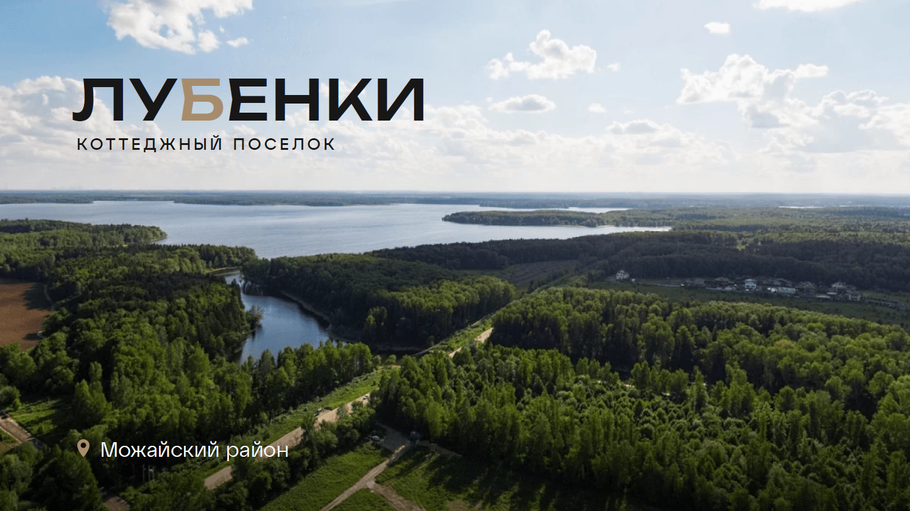
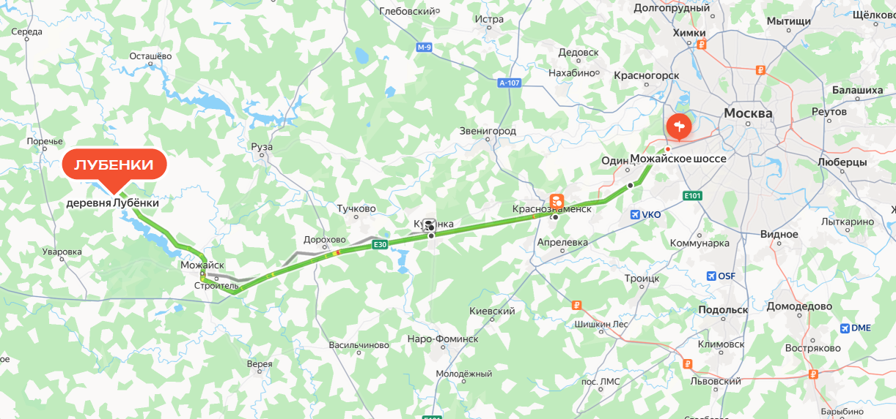
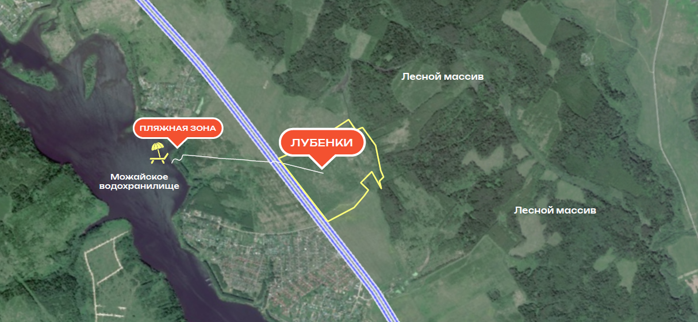

Участие в создании коттеджного поселка на берегу Можайского водохранилища с залоговым обеспечением.

## Паспорт проекта
[[columns]]
[[column]]
- **Локация:** Можайский р-н (берег водохранилища)
- **Тип актива:** Ленд-девелопмент (участки ИЖС)
[[column]]
- **Статус:** Идут работы по изменению ВРИ на ИЖС
- **Обновлено:** Март 2026
[[/columns]]

---

## Цель проекта

Строительство коттеджного поселка на берегу Можайского водохранилища.

Конечный продукт: участки с коммуникациями без подряда.

## Преимущества проекта
[[columns]]
[[column]]
- Организованный коттеджный поселок с коммуникациями
- Прилегает к большому лесному массиву
- Близость к Можайскому водохранилищу
- Собственная пляжная зона
- Прокат оборудования для активного отдыха (рыбалка, лодки, катамараны, скутеры)
[[column]]
- Удобная транспортная доступность
- Экологически чистая среда: свежий воздух и нетронутая природа
- Сочетание комфорта и природной красоты
[[/columns]]

## Финансируемые работы
[[columns]]
[[column]]
- Изменение ВРИ на «ИЖС»
- Расчистка участка
- Получение ТУ на присоединение сетей
- Раздел на 350-400 участков
[[column]]
- Начало строительства поселка:
  - Ограждение
  - Входная группа
  - Дороги первой очереди
  - Электросети
[[/columns]]

## Экономическая модель
[[callout | info]]
**Как работает капитализация:** Доход формируется за счет существенного повышения рыночной стоимости актива в процессе его развития (перевод земли в ИЖС, создание сетей и дорог).

Подробный расчет экономики под ваш бюджет и условия участия доступны в Telegram-боте.
[[/callout]]

## Инициатор

Собственником закладываемого участка выступает девелопер **Анатолий Голубенко**.

Опыт в переводе земли с 2008 года. Переведено 4 территории в Московской области общей площадью 139 га. Продано более 1000 участков в 6 посёлках.

## Предмет залога

Предметом залога выступает земельный участок, принадлежащий Заёмщику.

[[columns]]
[[column]]
- **Адрес:** МО, р-н Можайский, д. Лубёнки
- **Площадь:** 60 га (599 628 +/- 6776 кв.м)
[[column]]
- **Кадастровый номер:** 50:18:0070132:23
- **Яндекс Карты:** [Ссылка](https://yandex.ru/maps/-/CDhrAHkj)
[[/columns]]

## Проведенные работы в отношении участка

| Инстанция | Решение | Дата получения |
|-----------|-------------|----------------|
| Министерство сельского хозяйства и продовольствия | Подано обращение. Получен ответ об отсутствии скотомогильников и подтверждение, что ЗУ относится к землям мелиорации | 14.05.24 |
| ФГБУ «Спецмелиоводхоз» | Подано обращение. Предоставлен отчет об отсутствии на земельном участке мелиоративной системы | 19.08.24 |
| Управление Росреестра Московской области | Подано обращение о наличии/отсутствии ошибки в кадастровой стоимости. Получен ответ об отсутствии ошибки. Подготовлена Экспертиза. | 28.06.24 |
| Министерство культурного наследия | Получен ответ об отсутствии объектов культурного наследия на земельном участке. | 27.05.24 |
| Роспотребнадзор | Получен ответ о нахождении ЗУ свыше 500 метров от зоны санитарной охраны источников водоснабжения | 09.07.24 |
| Росагрохим | Проведено обследование. Подготовлен отчет о непригодности данных земель для ведения сельского хозяйства | 20.09.24 |
| ИСОГД | Информация предоставлена | 31.05.24 |

## Часто задаваемые вопросы (FAQ)

**Что является обеспечением?**
Обеспечением выступает залог земельного участка площадью 60 га на берегу Можайского водохранилища. В случае коллективных инвестиций залогодержателем выступает специализированный управляющий залогом в интересах всех инвесторов (ст. 356 ГК РФ).

**Какие риски у проекта по переводу земли?**
Основной риск — задержка сроков согласования. Для его минимизации инициатор уже провел все предварительные изыскания (Роспотребнадзор, Минкульт, Росагрохим), подтвердившие отсутствие обременений для перевода в ИЖС.

**Как я могу контролировать ход проекта?**
Все этапы работ (от юридических решений до строительства дорог) фиксируются в открытом Telegram-канале проекта. Также инвесторы получают ежемесячные отчеты о прогрессе.

## Ход работ

Следите за ходом реализации проекта в открытом Telegram-канале: [КП «Лубёнки»](https://t.me/lubenki_redevest)

## Документы

Полный пакет документов (выписки, отчеты изысканий, проект договора) доступен в Telegram-боте после прохождения идентификации.
