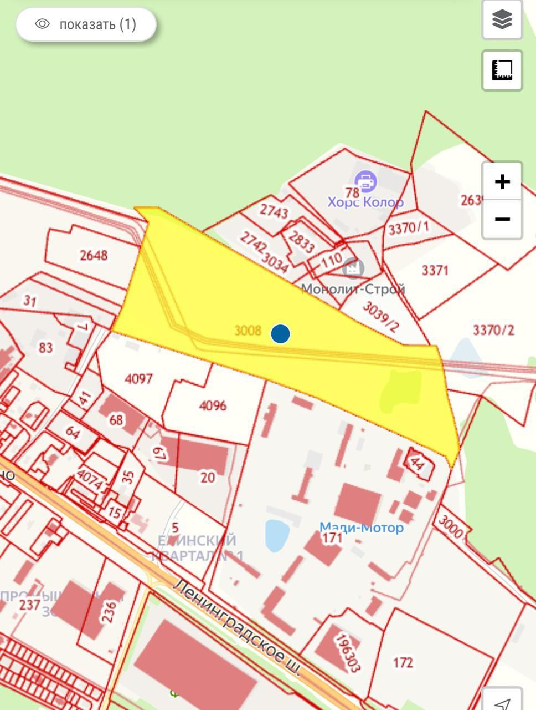
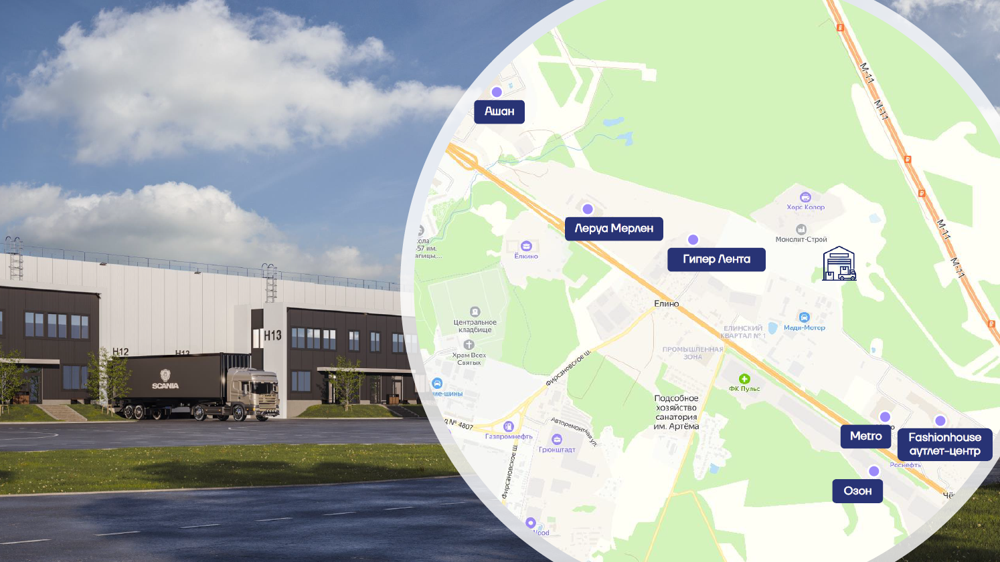

## Цель финансирования

Строительство логистического парка "Лунёвские ворота" - современного комплекса для размещения производственно-складских помещений в Солнечногорском районе Московской области.

## Преимущества проекта

[[columns]]
[[column]]
- Объём эксплуатируемых площадей **80 000 кв м**
- Готовая инженерная и IT-инфраструктура
- Управляющая компания и комплексная эксплуатация
- Автомоечный комплекс, магазины и кафе
- Доступ к производственно-складским помещениям 24/7
[[column]]
- Парковочные места для транспорта
- Ожидаемые сроки строительства: 1 кв 2025 — 3 кв 2026 года
- Высокий потенциал роста стоимости
- Стратегическое расположение в Московской области
- Развитая транспортная инфраструктура
- Перспективный рынок складской недвижимости
[[/columns]]

## Финансируемые работы

[[columns]]
[[column]]
- Подведение ресурсов необходимой мощности
- Согласование строительства и сокращение охранных зон
- Прокладка дорог и коммуникаций
- Благоустройство территории
[[column]]
- Межевание и продажа участков резидентам парка
- Проектирование и согласование проекта
- Получение разрешительной документации
[[/columns]]

## Займ

### Общие условия

- **Общая сумма:** 280 млн. руб. тремя траншами
- **Фиксированная ставка:** 45% годовых
- **Срок:** 1 год с мораторием на досрочное погашение 6 месяцев
- **Обеспечение:** залог земельного участка площадью 16 га
- **Способ выхода:** по выбору кредитора:
  - Погашение тела и процентов заемщиком
  - Конвертация в инвестицию второго этапа
- **Периодичность выплат:** В конце срока этапа или при полном досрочном погашении/конвертации
- **Источники погашения:**
  - Продажи земли конечным пользователям - резидентам будущего логопарка
  - Часть аванса по генподряду на строительство больших складских зданий
  - Банковский кредит под залог участка
  - Приходы по другим проектам девелопера

### Транши финансирования

| Дата выдачи | Декабрь 2024 г. | Февраль 2026 г. | Март 2026 г. |
|-------------|-----------------|----------------|-----------------|
| **Сумма** | 30 млн. руб. | 50 млн. руб. | 200 млн. руб. |
| **Условия выдачи** | Положительное решение Межведомственной комиссии по переводу земель в промышленные | Выписка из ЕГРН с категорией "земли промышленности" | - |
| **Финансируемые мероприятия** | Перевод земель в категорию промышленности | Проектирование переноса коммуникаций, получение ТУ | Перенос коммуникаций |

### Условия для коллективных инвестиций

1. У инвестора первого транша будет преимущественное право на финансирование второго транша.
2. Залогодержателем будет инвестор или специализированный управляющий залогом.

## Заёмщик

Заёмщиком и собственником закладываемого участка выступает девелопер **Анатолий Голубенко**.

Опыт в переводе земли с 2008 года. Переведено 4 территории в Московской области общей площадью 139 га.

## Предмет залога

[[columns]]
[[column]]
- **Адрес:** МО, р-н Солнечногорский, с/п Лунёвское
- **Площадь:** 16 га (160 625 кв.м)
- **Кадастровый номер:** 50:09:0060510:3008
[[column]]
- **Стоимость после перевода:** ~1 млрд. руб.
- **Текущий статус:** Положительное решение Межведомственной комиссии получено
- **Категория:** Земли промышленности
[[/columns]]

### Расположение участка

- **Кадастровая карта:** [Ссылка](https://rosreestr-doc.ru/%D0%BA%D0%B0%D0%B4%D0%B0%D1%81%D1%82%D1%80%D0%BE%D0%B2%D0%B0%D1%8F_%D0%BA%D0%B0%D1%80%D1%82%D0%B0#lat=55.988872&lng=37.288400&ct=55.988828&cg=37.285451&zoom=15)
- **Яндекс Карты:** [Ссылка](https://yandex.ru/maps/?l=trf%2Ctrfe&ll=37.287850%2C55.989000&mode=whatshere&whatshere%5Bpoint%5D=37.286649%2C55.989577&whatshere%5Bzoom%5D=16&z=15)

## Охранные зоны и решения

План участка с выделенными зонами под капитальную застройку. Существующие охранные зоны позволяют выделить под пятна застройки 9 га земли.

### Решения по охранным зонам

| Охранная зона | Описание | Решение | Статус согласования |
|---------------|----------|---------|-------------------|
| **ПАО «Россети» (МОЭСК)** | ЛЭП 6-КВ | Перенос линии в левую сторону участка с укладкой кабеля в землю | Предварительно согласовано |
| **Газпромтрансгаз** | Магистральный газопровод-отвод "Химки-Крюково" | Сокращение защитных зон и возможность возведений некапитальных строений | Предварительно согласовано с эксплуатирующими организациями |
| **Гослесфонд** | Расположение в зоне Гослесфонда | Произведена расчистка участка от существующей поросли | Получен подтверждающий документ, что Гослесфонда нет |
| **Приаэродромная территория** | Запрет размещения объектов выше 242 м | Не релевантно для складов | Согласование получается автоматически после предоставления проекта |
| **Зона санитарной охраны** | Расположение земельного участка в охранной зоне | Перенос коммуникаций вдоль границы участка | - |

## Аналитика рынка

### Сравнение с аналогичными объектами

| Адрес | Пояснение | Площадь (кв.м) | Цена (руб) | Цена за гектар (руб) |
|-------|-----------|----------------|------------|---------------------|
| **МО, г.о. Химки** | ВРИ: с/х производство | 34 482 | 517 230 000 | 150 000 000 |
| **МО, Солнечногорский р-н** | Земли ПРОМ для складского комплекса | 20 497 | 195 000 000 | 95 135 873 |
| **МО, Химки, мкр. Сходня** | Складской комплекс с проектом | 14 137 | 223 000 000 | 157 742 093 |

## Ход работ

Следите за ходом реализации проекта в открытом Telegram-канале: [Лунёвские ворота - ход работ](https://t.me/lunevo_redevest)

## Документы

- [ЕГРН участка](https://example.com/egrn) (50:09:0060510:3008)
- [ГПЗУ участка](https://example.com/gpzu) (30_08_2024_Голубенко)