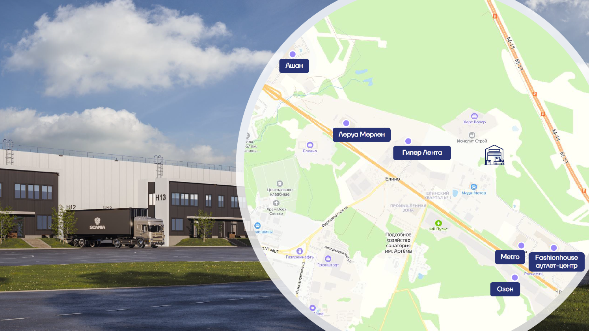
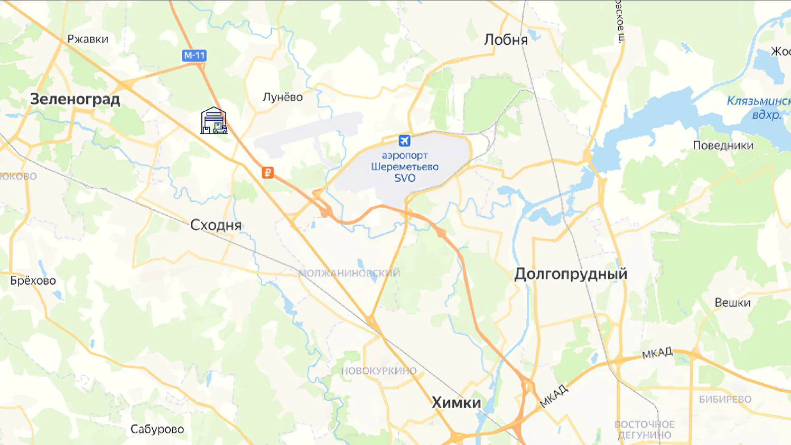
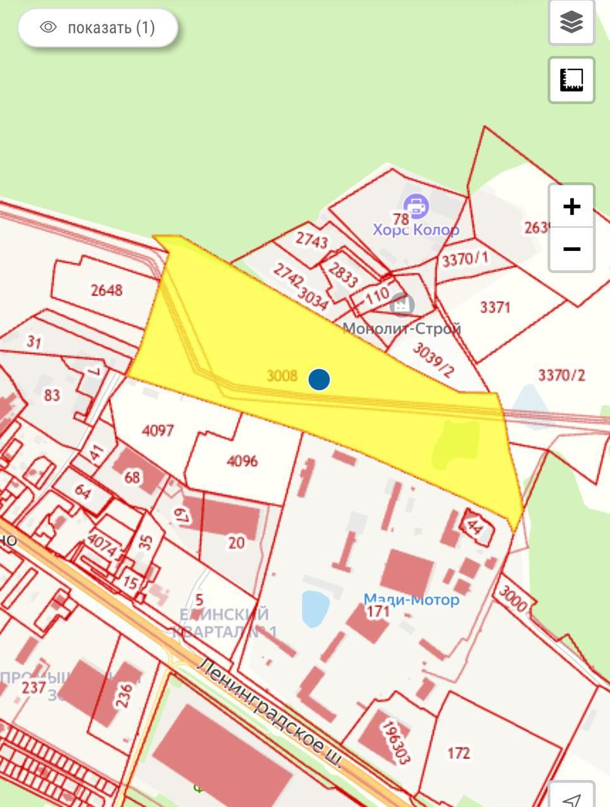

[[gallery]]

[[/gallery]]

## Паспорт проекта

[[callout | info]]
**Кратко**: участие в финансировании строительства логопарка в 15 км от МКАД под залог земельного участка.
[[/callout]]

[[columns]]
[[column]]
- **Локация:** г.о. Химки (15 км от МКАД)
- **Тип актива:** Складской комплекс (Light Industrial)
[[column]]
- **Статус:** завершение перевода участка в промышленное использование (апрель-май 2026)
- **Объем привлечения:** 300 млн руб.
[[/columns]]

[[callout | success]]
Администрация городского округа Химки **одобрила проект** — так будет проще согласовать перевод земли и дальнейшие разрешения. Подробнее в [канале о ходе работ](https://t.me/lunevo_redevest/42).
[[/callout]]

---

## Экономическая модель и цель

[[callout | info]]
**Суть:** стоимость актива растёт за счёт перевода земли в промышленное использование и появления современных корпусов Light Industrial. Модель прошла стресс-тестирование по цене продажи лотов (запас прочности при изменении рыночной конъюнктуры).
[[/callout]]

Инициатор строит логистический парк «Лунёвские ворота» — производственно-складской комплекс общей площадью около **46 000 м²**.

### Преимущества проекта
[[columns]]
[[column]]
- Контейнерная площадка, парковки, разворотные карманы
- Бизнес-центр, общежитие, спортплощадки, магазины и кафе
- Инженерия и IT-инфраструктура «под ключ»
- Управляющая компания и эксплуатация на территории
[[column]]
- В этой зоне дефицит площадей Light Industrial при живом спросе
- Около 15 км до МКАД по Ленинградскому шоссе, удобный выезд
- Уже ведутся переговоры с потенциальными арендаторами
- Доступ в помещения круглосуточно
[[/columns]]

---

## Безопасность и обеспечение

### Инициатор
Ведем проект и предоставляет землю под залог девелопер **Анатолий Голубенко**.

С 2008 года занимается переводом земель и строительством. В портфеле четыре участка в Московской области, суммарно около 139 га.

### Предмет залога
Интересы участников защищены залогом земельного участка площадью **16 га**, на котором развивается логопарк.

[[callout | success]]
**Официальная оценка актива:** ориентир 2,3 млрд руб. после перевода в промышленное использование.
**Запас прочности:** LTV ~15% — покрытие обязательств залогом более чем в 6 раз.
[[/callout]]

- **Адрес:** МО, г.о. Химки, с/п Лунёвское
- **Кадастровый номер:** 50:09:0060510:3008
- **На карте:** [Участок на кадастровой карте](https://rosreestr-doc.ru/%D0%BA%D0%B0%D0%B4%D0%B0%D1%81%D1%82%D1%80%D0%BE%D0%B2%D0%B0%D1%8F_%D0%BA%D0%B0%D1%80%D1%82%D0%B0#lat=55.988872&lng=37.288400&ct=55.988828&cg=37.285451&zoom=15) | [Локация и окружение на Яндекс Картах](https://yandex.ru/maps/?l=trf%2Ctrfe&ll=37.287850%2C55.989000&mode=whatshere&whatshere%5Bpoint%5D=37.286649%2C55.989577&whatshere%5Bzoom%5D=16&z=15)

[[gallery]]

[[/gallery]]

## Аналитика рынка

Сравнение заложенного участка с аналогичными объектами (предложения в локации):

| Адрес | Пояснение | Площадь (кв.м) | Цена (руб) | Цена за гектар (руб) |
|-------|-----------|----------------|------------|---------------------|
| **МО, г.о. Химки** | ВРИ: с/х производство | 34&nbsp;482 | 517&nbsp;230&nbsp;000 | 150&nbsp;000&nbsp;000 |
| **МО, Солнечногорский р-н** | Земли ПРОМ для складского комплекса | 20&nbsp;497 | 195&nbsp;000&nbsp;000 | 95&nbsp;135&nbsp;873 |
| **МО, Химки, мкр. Сходня** | Складской комплекс с проектом | 14&nbsp;137 | 223&nbsp;000&nbsp;000 | 157&nbsp;742&nbsp;093 |

*Источник данных: ЦИАН, март 2026.*

---

## Виртуальный тур

Ниже виртуальный тур по концепции парка: можно пройти территорию и заглянуть в типовые блоки.

[[iframe | https://portfolio5.3dpanorama.spb.ru/2026-02/render-v04/]]

---

## Фонд Редевест — надежность сообщества
Синдикация коллективных инвестиций производится фондом Редевест.

Мы не просто «управляем» чужими деньгами — мы инвестируем вместе с вами.
- **С 2020 года** в реальные активы (склады, землю, отели).
- **8 500+ инвесторов** в основном канале фонда.
- **1 млрд+ руб.** привлеченного капитала в проекты редевелопмента.
- **20+ лет** суммарного опыта команды в девелопменте и инвестициях.

---

## Путь инвестора
1. **Запрос доступа** в Telegram-боте (пройдите идентификацию и получите презентацию и финмодель).
2. **Ваш аудит** (проверка финмодели, локации и рисков).
3. **Обсуждение условий** (персональный расчет доходности и порога входа).
4. **Оформление сделки** (официальная регистрация договора займа и залога).

---

## Часто задаваемые вопросы

[[toggle | Кто такой Алексей Лещенко и Редевест?]]
Алексей Лещенко — основатель и CEO фонда Редевест, инвестор и девелопер. С 2020 года мы инвестируем в склады, коттеджные поселки, отели, создание торговых ГАБов и флиппинг квартир. Мы сами ищем проекты, считаем финмодели, оцениваем риски и сами вкладываемся в каждый проект наравне с соинвесторами, которых мы привлекаем. Мы вложили уже более 1 млрд руб. Мы ведем инвесторское сообщество из 8 000+ человек. В проекте "Лунёвские ворота", как ив других, мы отвечаем за привлечение инвестиций, обеспечение инвесторов залогом и контроль хода проекта.

[[toggle | Как защищены мои инвестиции?]]
Используем механизм управления залогом по **ст. 356 ГК РФ**. Залог земельного участка 16 га регистрируется в Росреестре. Мы от лица инвесторов накладываем и снимаем обеспечение в Росреестре, когда обязательства перед инвесторами исполнены. Имущество в управлении залогом обособлено — оно не может быть взыскано по личным долгам управляющего.

[[toggle | Что если сроки перевода земли или строительства сдвинутся?]]
В девелопменте это случается. В таких ситуациях мы действуем открыто: вы видите реальную картину в Telegram-канале хода работ и в ежемесячных отчетах. Главное — ваши деньги защищены реальным активом (землей), рыночная стоимость которой даже без перевода ВРИ покрывает обязательства, а после перевода — превышает их в 6 раз.

[[toggle | Как контролируется ход проекта?]]
Фонд Редевест контролирует целевое использование средств и сроки проекта. Основная отчетность для инвесторов — в живом режиме в канале [Лунёвские ворота — ход работ](https://t.me/lunevo_redevest).

[[toggle | Что является обеспечением?]]
Интересы участников защищены залогом земельного участка площадью 16 га. Оценка, произведенная официальным оценщиком, показывает многократный запас относительно суммы обязательств.
